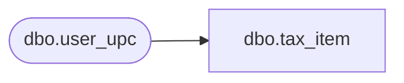

# dbo.tax_item

**Database:** auditworks_external  
**Server:** bedrockdb01  

## Architecture Diagram



## Table Dependencies

| Referenced Table |
|---|
| dbo.user_upc |

## View Code

```sql
create view dbo.tax_item  
  AS 
  SELECT upc_lookup_division,
	item_id = convert(varchar(20), null),
        item_no = convert(numeric(14,0), upc_no),
        style_reference_id,
        sku_id,
        tax_item_group_id
    FROM auditworks_external.dbo.user_upc
```

