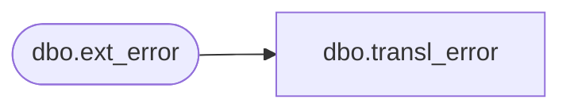

# dbo.transl_error

**Database:** auditworks_external  
**Server:** bedrockdb01  

## Architecture Diagram



## Table Dependencies

| Referenced Table |
|---|
| dbo.ext_error |

## View Code

```sql
CREATE VIEW dbo.transl_error AS
   SELECT store_no,
          register_no,
          entry_date_time,
          transaction_series,
          transaction_no,
          line_id,
          transl_reject_reason,
          output_file_code,
          output_file_column,
          posting_start_date_time,
          posting_end_date_time,
          file_name,
          file_size,
          transaction_count,
          bad_data_pos,
          bad_data_output,
          transl_error_msg 
     FROM auditworks_work.dbo.ext_error
```

