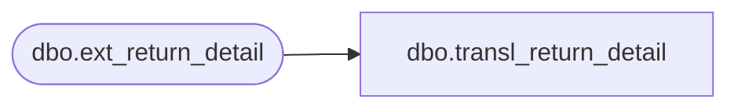

# dbo.transl_return_detail

**Database:** auditworks_external  
**Server:** bedrockdb01  

## Architecture Diagram



## Table Dependencies

| Referenced Table |
|---|
| dbo.ext_return_detail |

## View Code

```sql
CREATE VIEW dbo.transl_return_detail AS
   SELECT store_no,
          register_no,
          entry_date_time,
          transaction_series,
          transaction_no,
          line_id,
          via_warehouse_flag,
          return_reason_message,
          return_reason_code,
          mdse_disposition_code,
          return_from_store,
          return_from_reg,
          return_from_date,
          return_from_transno,
          original_salesperson,
          original_salesperson2,
          without_receipt_flag,
          lookup_pos_code,
          pos_description,
          row_sequence_no,
          transaction_id,
          store_no_check 
     FROM auditworks_work.dbo.ext_return_detail
```

