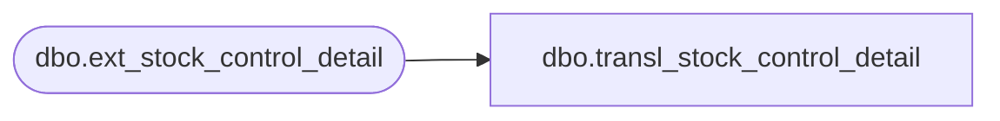

# dbo.transl_stock_control_detail

**Database:** auditworks_external  
**Server:** bedrockdb01  

## Architecture Diagram



## Table Dependencies

| Referenced Table |
|---|
| dbo.ext_stock_control_detail |

## View Code

```sql
CREATE VIEW dbo.transl_stock_control_detail AS
   SELECT store_no,
          register_no,
          entry_date_time,
          transaction_series,
          transaction_no,
          line_id,
          upc_no,
          merchandise_key,
          initiated_by_host,
          units,
          other_store_no,
          location_no,
          vendor_no,
          count_date,
          pos_deptclass,
          pos_identifier,
          pos_identifier_type,
          row_sequence_no,
          upc_lookup_division,
          originating_store_no,
          transaction_id,
          upc_on_file_flag,
          display_def_id,
          reason,
          imrd,
          sku_id,
          style_reference_id,
          lookup_pos_code,
          pos_description,
          lookup_pos_code_imrd,
          pos_description_imrd,
          lookup_pos_code_vendor,
          pos_description_vendor,
          auto_config_verified 
     FROM auditworks_work.dbo.ext_stock_control_detail
```

