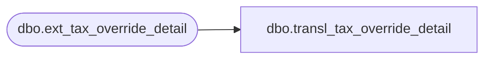

# dbo.transl_tax_override_detail

**Database:** auditworks_external  
**Server:** bedrockdb01  

## Architecture Diagram



## Table Dependencies

| Referenced Table |
|---|
| dbo.ext_tax_override_detail |

## View Code

```sql
CREATE VIEW dbo.transl_tax_override_detail AS
   SELECT store_no,
          register_no,
          entry_date_time,
          transaction_series,
          transaction_no,
          line_id,
          tax_level,
          tax_category,
          taxable,
          exception_tax_jurisdiction,
          tax_exempt_no,
          row_sequence_no,
          transaction_id 
     FROM auditworks_work.dbo.ext_tax_override_detail
```

