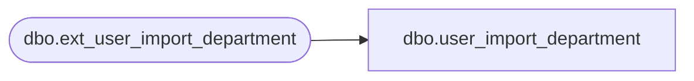

# dbo.user_import_department

**Database:** auditworks_external  
**Server:** bedrockdb01  

## Architecture Diagram



## Table Dependencies

| Referenced Table |
|---|
| dbo.ext_user_import_department |

## View Code

```sql
CREATE VIEW dbo.user_import_department AS
 SELECT entry_type, 
 	department_code, 
 	department_description, 
 	upc_lookup_division, 
 	import_id 
   FROM auditworks_work.dbo.ext_user_import_department
```

