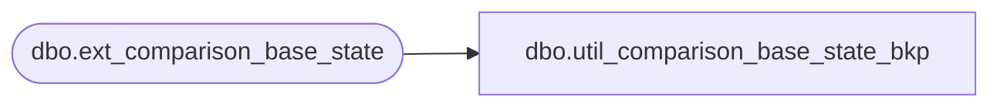

# dbo.util_comparison_base_state_bkp

**Database:** auditworks_external  
**Server:** bedrockdb01  

## Architecture Diagram



## Table Dependencies

| Referenced Table |
|---|
| dbo.ext_comparison_base_state |

## View Code

```sql
CREATE VIEW dbo.util_comparison_base_state_bkp AS
   SELECT comparison_id,
          table_name,
          validation_area,
          comparison_key,
          comparison_text1,
          comparison_text2,
          comparison_text_minor 
     FROM auditworks_work.dbo.ext_comparison_base_state
```

