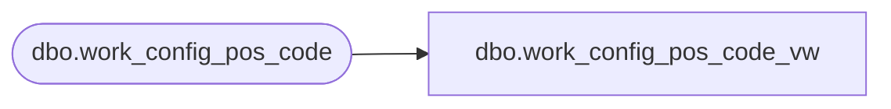

# dbo.work_config_pos_code_vw

**Database:** auditworks_external  
**Server:** bedrockdb01  

## Architecture Diagram



## Table Dependencies

| Referenced Table |
|---|
| dbo.work_config_pos_code |

## View Code

```sql
create view dbo.work_config_pos_code_vw AS
SELECT request_id,
       table_name,
       code_type,
       code,
       line_object,
       lookup_pos_code,
       pos_description,
       disregard_pos_descr_change,
       card_type,
       foreign_currency_flag,
       reference_no_length,
       line_action,
       transaction_category,
       attachment_type,
       note_type,
       merchandise_category,
       upc_lookup_division,
       language_id,
       resource_id,
       new_code_flag,
       desc_update_flag,
       entry_date,
       form_name,
       issued_flag,
       store_no, register_no, entry_date_time,  transaction_series,  transaction_no, line_id, transaction_line_string FROM dbo.work_config_pos_code
```

