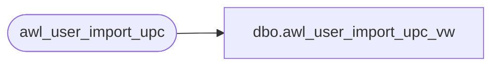

# dbo.awl_user_import_upc_vw

**Database:** auditworks_work  
**Server:** bedrockdb01  

## Architecture Diagram



## Table Dependencies

| Referenced Table |
|---|
| awl_user_import_upc |

## View Code

```sql
create view dbo.awl_user_import_upc_vw 
       (entry_type, upc_no, sku_id, pos_identifier, 
       pos_identifier_type, style_reference_id, import_id)
AS
SELECT entry_type, upc_no, sku_id, pos_identifier, 
       pos_identifier_type, style_reference_id, import_id
FROM awl_user_import_upc
```

