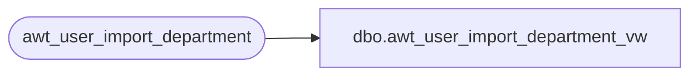

# dbo.awt_user_import_department_vw

**Database:** auditworks_work  
**Server:** bedrockdb01  

## Architecture Diagram



## Table Dependencies

| Referenced Table |
|---|
| awt_user_import_department |

## View Code

```sql
create view dbo.awt_user_import_department_vw 
    (entry_type, department_code, department_description, import_id)
AS SELECT entry_type, department_code, department_description, import_id
FROM awt_user_import_department
```

