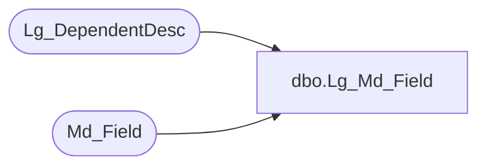

# dbo.Lg_Md_Field

**Database:** foundation  
**Server:** bedrockdb01  

## Architecture Diagram



## Table Dependencies

| Referenced Table |
|---|
| Lg_DependentDesc |
| Md_Field |

## View Code

```sql
CREATE  view dbo.Lg_Md_Field  AS
	SELECT a.field_id, a.field_owner_id, a.table_id, a.topic_id, 
	       a.field_label_1, a.field_label_2, ISNULL(b.first_pair_text, a.field_label_1) as field_label_3,
	       a.field_description_1, a.field_description_2, ISNULL(b.second_pair_text, a.field_description_1) as field_description_3,
	       a.field_expression_1, a.field_expression_2, ISNULL(c.second_pair_text, a.field_expression_1) as field_expression_3,
	       a.field_type, a.field_format, a.field_width, a.field_size, a.field_permission, a.input_mask, a.field_flags, 
	       a.default_method, a.lookup_type, a.lookup_id, 
	       a.short_label_1, a.short_label_2, ISNULL(c.first_pair_text, a.short_label_1) as short_label_3,
	       a.field_period_group_id, a.subfield_lookup_id, a.native_type_syb, a.native_type_ora, a.native_type_sql, 
	       a.resource_id_1, a.resource_id_2, a.field_min_value, a.field_max_value, 
               a.field_label_resource_name, a.short_label_resource_name,
               c.language_id
	  FROM Md_Field a LEFT OUTER JOIN Lg_DependentDesc b ON a.resource_id_1 = b.resource_id
                                          LEFT OUTER JOIN Lg_DependentDesc c ON a.resource_id_2 = c.resource_id
```

