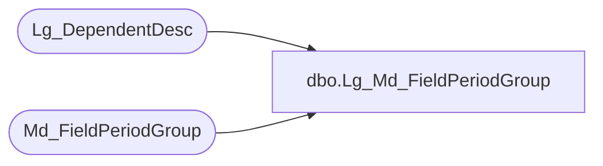

# dbo.Lg_Md_FieldPeriodGroup

**Database:** foundation  
**Server:** bedrockdb01  

## Architecture Diagram



## Table Dependencies

| Referenced Table |
|---|
| Lg_DependentDesc |
| Md_FieldPeriodGroup |

## View Code

```sql
create view dbo.Lg_Md_FieldPeriodGroup  AS
	SELECT a.topic_id, a.field_period_group_id, a.label_1, a.label_2, ISNULL(b.first_pair_text, a.label_1) as label_3,
	       a.description_1, a.description_2, ISNULL(b.second_pair_text, a.description_1) as description_3,
	       a.resource_id, b.language_id
	FROM Md_FieldPeriodGroup a LEFT OUTER JOIN Lg_DependentDesc b ON a.resource_id = b.resource_id
```

