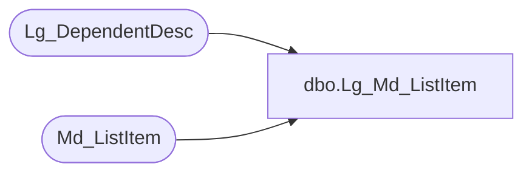

# dbo.Lg_Md_ListItem

**Database:** foundation  
**Server:** bedrockdb01  

## Architecture Diagram



## Table Dependencies

| Referenced Table |
|---|
| Lg_DependentDesc |
| Md_ListItem |

## View Code

```sql
create view dbo.Lg_Md_ListItem  AS
	SELECT a.list_id, a.list_item_sequence, a.list_item_label_1, a.list_item_label_2, ISNULL(b.first_pair_text, a.list_item_label_1) as list_item_label_3,
	       a.list_item_value, a.resource_id, b.language_id
	  FROM Md_ListItem a LEFT OUTER JOIN Lg_DependentDesc b ON a.resource_id = b.resource_id
```

