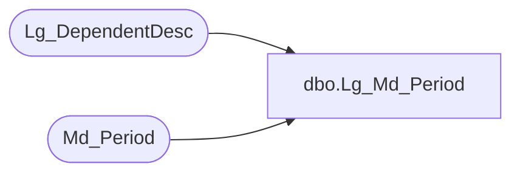

# dbo.Lg_Md_Period

**Database:** foundation  
**Server:** bedrockdb01  

## Architecture Diagram



## Table Dependencies

| Referenced Table |
|---|
| Lg_DependentDesc |
| Md_Period |

## View Code

```sql
create view dbo.Lg_Md_Period  AS
	SELECT a.period_id, a.topic_id, a.table_id, a.period_group_id, 
	       a.period_label_1, a.period_label_2, ISNULL(b.first_pair_text, a.period_label_1) as period_label_3, 
	       a.period_description_1, a.period_description_2, ISNULL(b.second_pair_text, a.period_description_1) as period_description_3,  
	       a.period_start_exp, a.all_dimensions, a.have_sub_periods, a.resource_id, 
               a.period_label_resource_name,
               b.language_id
	  FROM Md_Period a LEFT OUTER JOIN Lg_DependentDesc b ON a.resource_id = b.resource_id
```

