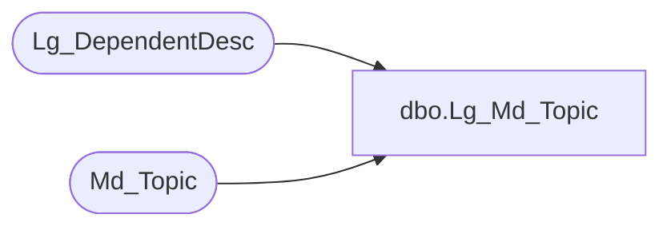

# dbo.Lg_Md_Topic

**Database:** foundation  
**Server:** bedrockdb01  

## Architecture Diagram



## Table Dependencies

| Referenced Table |
|---|
| Lg_DependentDesc |
| Md_Topic |

## View Code

```sql
create view dbo.Lg_Md_Topic  AS
	SELECT topic_id, topic_label_1, topic_label_2, ISNULL(b.first_pair_text,topic_label_1) as topic_label_3,
	       topic_description_1, topic_description_2, ISNULL(b.second_pair_text,topic_description_1) as topic_description_3, system_from_version,
	       system_to_version, data_source_name, user_name, user_password, md_version, md_instdate, md_scriptdate, 
	       extension_manager, delete_proc_name, a.resource_id, sec_app_id, sec_root_key, b.language_id, a.topic_label_resource_name
	  FROM Md_Topic a LEFT OUTER JOIN Lg_DependentDesc b ON a.resource_id = b.resource_id
```

