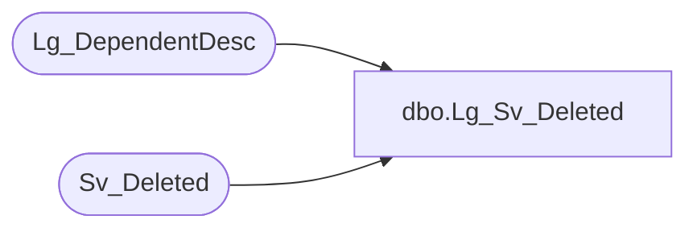

# dbo.Lg_Sv_Deleted

**Database:** foundation  
**Server:** bedrockdb01  

## Architecture Diagram



## Table Dependencies

| Referenced Table |
|---|
| Lg_DependentDesc |
| Sv_Deleted |

## View Code

```sql
create view dbo.Lg_Sv_Deleted  AS
	SELECT a.delete_id, a.deleted_id, a.deleted_date, a.object_id, a.topic_id, a.object_type, a.created_date, a.owner_id, a.modified_date,
		a.modified_id, a.last_used_date, a.last_used_id, 
		a.label_1, a.label_2, ISNULL(b.first_pair_text, a.label_1) as label_3, 
		a.description_1, a.description_2, ISNULL(b.second_pair_text, a.description_1) as description_3, 
		a.data, a.flags, a.permission, a.folder_id, a.item_sequence, a.output_data, a.crosstab_data, a.graph_data, 
		a.default_data_view, a.built_by_version, a.version, a.object_code, b.language_id
	FROM Sv_Deleted a LEFT OUTER JOIN Lg_DependentDesc b ON a.resource_id = b.resource_id
```

