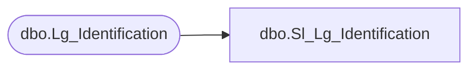

# dbo.Sl_Lg_Identification

**Database:** foundation  
**Server:** bedrockdb01  

## Architecture Diagram



## Table Dependencies

| Referenced Table |
|---|
| dbo.Lg_Identification |

## View Code

```sql
create view dbo.Sl_Lg_Identification (
	language_id,
	english_desc,
	display_desc,
	active_flag,
	column_position)
AS SELECT language_id,
	english_desc,
	display_desc,
	active_flag,
	column_position
FROM foundation.dbo.Lg_Identification
```

