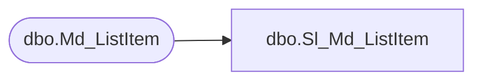

# dbo.Sl_Md_ListItem

**Database:** foundation  
**Server:** bedrockdb01  

## Architecture Diagram



## Table Dependencies

| Referenced Table |
|---|
| dbo.Md_ListItem |

## View Code

```sql
create view dbo.Sl_Md_ListItem (
	list_id, 
	list_item_sequence, 
	list_item_label_1, 
	list_item_label_2, 
	list_item_value, 
	resource_id)
AS SELECT list_id, 
	list_item_sequence, 
	list_item_label_1, 
	list_item_label_2, 
	list_item_value, 
	resource_id
FROM foundation.dbo.Md_ListItem
```

