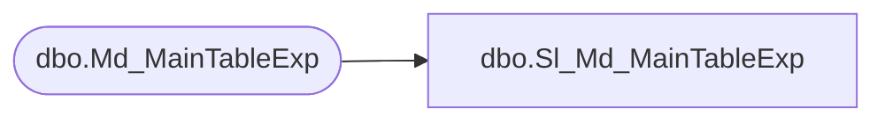

# dbo.Sl_Md_MainTableExp

**Database:** foundation  
**Server:** bedrockdb01  

## Architecture Diagram



## Table Dependencies

| Referenced Table |
|---|
| dbo.Md_MainTableExp |

## View Code

```sql
create view dbo.Sl_Md_MainTableExp 
(
	period_group_id,
	dim_tables_list,
	table_id 
)
AS SELECT 
	period_group_id,
	dim_tables_list,
	table_id 
FROM foundation.dbo.Md_MainTableExp
```

