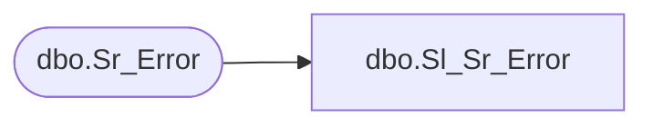

# dbo.Sl_Sr_Error

**Database:** foundation  
**Server:** bedrockdb01  

## Architecture Diagram



## Table Dependencies

| Referenced Table |
|---|
| dbo.Sr_Error |

## View Code

```sql
CREATE VIEW dbo.Sl_Sr_Error (error_id,execution_id,error_code,exe_name,class_name,function_name,message,error_datetime,extended_message)
AS SELECT error_id,execution_id,error_code,exe_name,class_name,function_name,message,error_datetime,extended_message
FROM foundation.dbo.Sr_Error
```

