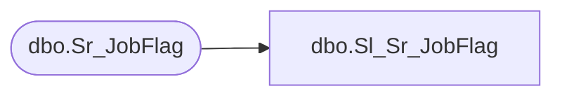

# dbo.Sl_Sr_JobFlag

**Database:** foundation  
**Server:** bedrockdb01  

## Architecture Diagram



## Table Dependencies

| Referenced Table |
|---|
| dbo.Sr_JobFlag |

## View Code

```sql
CREATE VIEW dbo.Sl_Sr_JobFlag (job_flag,job_flag_label_1,job_flag_label_2)
AS SELECT job_flag,job_flag_label_1,job_flag_label_2
FROM foundation.dbo.Sr_JobFlag
```

