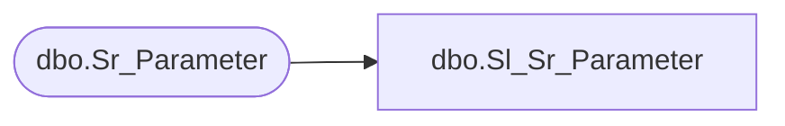

# dbo.Sl_Sr_Parameter

**Database:** foundation  
**Server:** bedrockdb01  

## Architecture Diagram



## Table Dependencies

| Referenced Table |
|---|
| dbo.Sr_Parameter |

## View Code

```sql
create view  dbo.Sl_Sr_Parameter (tag,tag_value,last_modified)
AS SELECT tag,tag_value,last_modified
FROM foundation.dbo.Sr_Parameter
```

