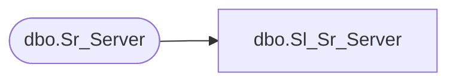

# dbo.Sl_Sr_Server

**Database:** foundation  
**Server:** bedrockdb01  

## Architecture Diagram



## Table Dependencies

| Referenced Table |
|---|
| dbo.Sr_Server |

## View Code

```sql
create view  dbo.Sl_Sr_Server (server_id,server_name,any_job,max_jobs,curr_status,requested_status,machine_id,autostart)
AS SELECT server_id,server_name,any_job,max_jobs,curr_status,requested_status,machine_id,autostart
FROM foundation.dbo.Sr_Server
```

