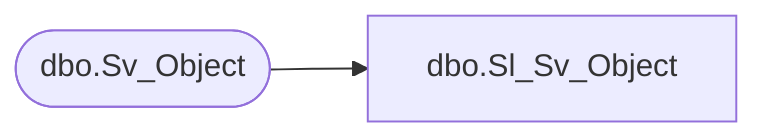

# dbo.Sl_Sv_Object

**Database:** foundation  
**Server:** bedrockdb01  

## Architecture Diagram



## Table Dependencies

| Referenced Table |
|---|
| dbo.Sv_Object |

## View Code

```sql
create view  dbo.Sl_Sv_Object (
       	object_id, 
       	topic_id, 
       	object_type, 
       	created_date, 
       	owner_id, 
       	modified_date, 
       	modified_id, 
       	last_used_date, 
       	last_used_id, 
       	label_1, 
       	label_2, 
       	description_1, 
       	description_2, 
       	data, 
       	flags, 
       	permission, 
       	object_code, 
       	built_by_version, 
       	version, 
       	web_access, 
       	resource_id
)
AS SELECT 
       	object_id, 
       	topic_id, 
       	object_type, 
       	created_date, 
       	owner_id, 
       	modified_date, 
       	modified_id, 
       	last_used_date, 
       	last_used_id, 
       	label_1, 
       	label_2, 
       	description_1, 
       	description_2, 
       	data, 
       	flags, 
       	permission, 
       	object_code, 
       	built_by_version, 
       	version, 
       	web_access, 
       	resource_id
FROM foundation.dbo.Sv_Object
```

