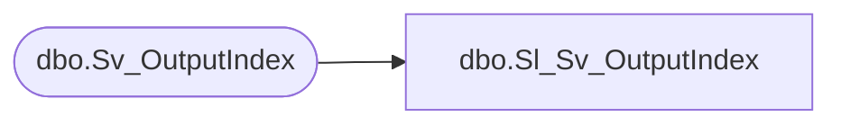

# dbo.Sl_Sv_OutputIndex

**Database:** foundation  
**Server:** bedrockdb01  

## Architecture Diagram



## Table Dependencies

| Referenced Table |
|---|
| dbo.Sv_OutputIndex |

## View Code

```sql
create view  dbo.Sl_Sv_OutputIndex (
       	output_id, 
       	sequence, 
       	index_level, 
       	index_type, 
       	index_data, 
       	page_number, 
       	position, 
       	index_field_id, 
       	index_node_id
)
AS SELECT 
       	output_id, 
       	sequence, 
       	index_level, 
       	index_type, 
       	index_data, 
       	page_number, 
       	position, 
       	index_field_id, 
       	index_node_id
FROM foundation.dbo.Sv_OutputIndex
```

