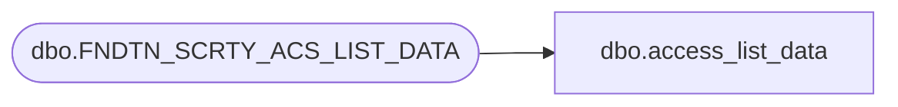

# dbo.access_list_data

**Database:** foundation  
**Server:** bedrockdb01  

## Architecture Diagram



## Table Dependencies

| Referenced Table |
|---|
| dbo.FNDTN_SCRTY_ACS_LIST_DATA |

## View Code

```sql
CREATE VIEW dbo.access_list_data (access_id,access_id_type,app_id,comp_id,ackey,ackey_data)
AS SELECT ACS_ID,ACS_ID_TYPE,APP_ID,CMPNY_ID,ACS_KEY,ACS_KEY_DATA
FROM dbo.FNDTN_SCRTY_ACS_LIST_DATA
```

