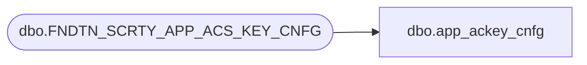

# dbo.app_ackey_cnfg

**Database:** foundation  
**Server:** bedrockdb01  

## Architecture Diagram



## Table Dependencies

| Referenced Table |
|---|
| dbo.FNDTN_SCRTY_APP_ACS_KEY_CNFG |

## View Code

```sql
CREATE VIEW dbo.app_ackey_cnfg (app_id,ackey,ackey_level,cnfg_comment)
AS SELECT APP_ID,ACS_KEY,ACS_KEY_LVL,CNFG_CMNT
FROM dbo. FNDTN_SCRTY_APP_ACS_KEY_CNFG
```

