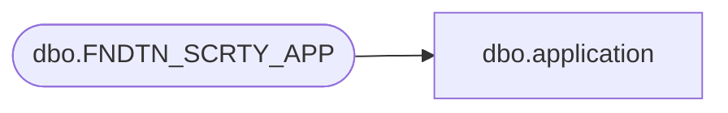

# dbo.application

**Database:** foundation  
**Server:** bedrockdb01  

## Architecture Diagram



## Table Dependencies

| Referenced Table |
|---|
| dbo.FNDTN_SCRTY_APP |

## View Code

```sql
CREATE VIEW dbo.application (app_id,app_name,app_description,app_hierarchy_level,app_license,app_use_sts_auth,
app_create_sybase_acct,app_allow_multi_instance,app_disallow_l0_full_access)AS SELECT APP_ID,APP_NAME,APP_DESC,APP_HRCHY_LVL,APP_LCNS,APP_USE_NSB_AUTH,
APP_CRT_SBS_ACT,APP_ALW_MLTI_INSTNC,APP_DSLW_L0_FULL_ACS
FROM dbo.FNDTN_SCRTY_APP
```

