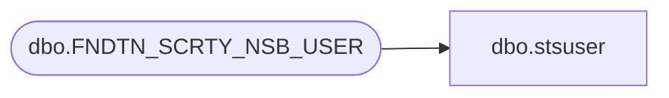

# dbo.stsuser

**Database:** foundation  
**Server:** bedrockdb01  

## Architecture Diagram



## Table Dependencies

| Referenced Table |
|---|
| dbo.FNDTN_SCRTY_NSB_USER |

## View Code

```sql
create view  dbo.stsuser (user_id,user_name,user_fullname,user_description,user_password,user_domain,user_lockout,user_sid,user_guid,can_encrypt, can_decrypt, expiry_date)
AS SELECT USER_ID,USER_NAME,USER_FULL_NAME,USER_DESC,USER_PSWRD,USER_DMN,USER_LCKT,USER_SID,USER_GUID,CAN_ENCRYPT,CAN_DCRYPT,EXPRY_DATE
FROM dbo.FNDTN_SCRTY_NSB_USER
```

