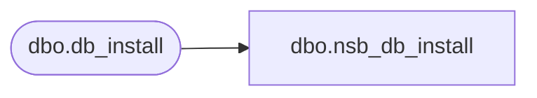

# dbo.nsb_db_install

**Database:** foundation_event  
**Server:** bedrockdb01  

## Architecture Diagram



## Table Dependencies

| Referenced Table |
|---|
| dbo.db_install |

## View Code

```sql
CREATE VIEW [dbo].[nsb_db_install] (execution_id
```

