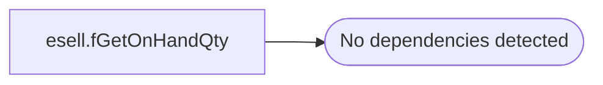

# esell.fGetOnHandQty

**Database:** esell  
**Server:** bedrockdb02  
**Function Type:** Scalar Function  
**Returns:** int(4)  

## Architecture Diagram



## Parameters

| Parameter | Data Type | Max Length | Is Output |
|---|---|---|---|
| @sku_id | varchar | 24 | NO |

## Table Dependencies

_No table dependencies detected._

## Function Code

```sql

-- =============================================
-- Author:		Brian McLaughlin
-- Create date: 09/26/2013
-- Description:	Gets the Quantity on Hand for a SKU, only returns positive value or zero.
-- =============================================
CREATE FUNCTION [esell].[fGetOnHandQty] ( @sku_id varchar(24) )
RETURNS int
AS
BEGIN
    DECLARE @Result AS INT
    
    DECLARE @OnHand AS INT = ( SELECT sum(qty - threshold - inv_status_1) 
                               FROM outlet_sku_xref 
                               WHERE outlet_id NOT IN 
                                   (
                                   SELECT outlet_id 
                                   FROM outlet A 
                                   WHERE A.search_allowed_cd = 'N'
                                   ) 
                               AND sku_id = @sku_id );
    
    DECLARE @SearchAllowed AS CHAR(1) = ( SELECT search_allowed_cd 
                                          FROM sku 
                                          WHERE sku_id = @sku_id )
    SELECT @Result = 
        CASE 
            WHEN ( @OnHand <= 0 OR @SearchAllowed = 'N') 
                THEN 0 
                ELSE @OnHand
            END

    RETURN @Result
END
```
