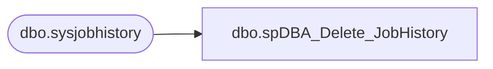

# dbo.spDBA_Delete_JobHistory

**Database:** DBAUtility  
**Server:** bedrockdb02  

## Architecture Diagram



## Table Dependencies

| Referenced Table |
|---|
| dbo.sysjobhistory |

## Stored Procedure Code

```sql
CREATE PROC [dbo].[spDBA_Delete_JobHistory]
@Action VARCHAR(20) = 'Process'
As

-- =============================================================================================================
-- Name: spDBA_Delete_JobHistory
--
-- Description:	Deletes job history in chunks
--
-- Output: none
-- 
-- Available actions:
-- @Action:
--	'ReturnVersion' = Do not do anything but return the version of the objects
--	'Process' = populate the object version log 

-- Dependencies: 
--  None
--
-- Revision History:
--		Mike Pelikan	06/27/2012		Modified for versioning
--										Added Comments

-- =============================================================================================================
DECLARE @Revision DATETIME
SET @Revision = '06/27/2012'

----------------------------------------------------------------------------------------------------
--// Set options                                                                                //--
----------------------------------------------------------------------------------------------------
SET NOCOUNT ON

----------------------------------------------------------------------------------------------------
--// Revision                                                                                  //--
----------------------------------------------------------------------------------------------------
IF @Action = 'ReturnVersion'
BEGIN
	GOTO EndHere
END

----------------------------------------------------------------------------------------------------
--// Declare variables                                                                          //--
----------------------------------------------------------------------------------------------------

DECLARE @OldestJobHistoryDate DATETIME
DECLARE @DaysToLeave INT
DECLARE @DaysToDeleteAtOnce INT
DECLARE @DeleteDate DATETIME
DECLARE @Counter INT
DECLARE @CounterText VARCHAR(100)
DECLARE @datepart INT

----------------------------------------------------------------------------------------------------

SELECT @OldestJobHistoryDate = convert(datetime,rtrim(run_date)) 
FROM msdb..sysjobhistory
WHERE instance_id = (select MIN(instance_id) FROM msdb..sysjobhistory)

SELECT @OldestJobHistoryDate
SET @DaysToLeave = 60
SET @DaysToDeleteAtOnce = 1

SELECT @Counter = DATEDIFF(DAY,@OldestJobHistoryDate,GETDATE())

WHILE @Counter >= @DaysToLeave  
BEGIN   
 SET @CounterText = CONVERT(VARCHAR(30),GETDATE(),21) + ' processing ' + CONVERT(VARCHAR(30),DATEADD(DAY, -@Counter,GETDATE()),21)
 SELECT @DeleteDate = CONVERT(VARCHAR(30),DATEADD(DAY, -@Counter,GETDATE()),21) 
 RAISERROR (@CounterText , 10, 1) WITH NOWAIT   
 SET @datepart = CONVERT(INT, CONVERT(VARCHAR, @DeleteDate, 112))
 DELETE FROM msdb.dbo.sysjobhistory WHERE (run_date < @datepart)
 SELECT @Counter = @Counter - @DaysToDeleteAtOnce  
END 

EndHere:
IF @Action = 'ReturnVersion'
BEGIN
	SELECT @Revision 
END
```

