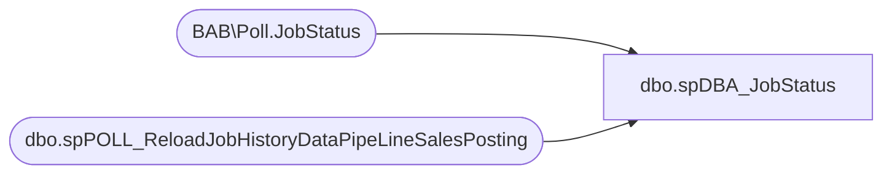

# dbo.spDBA_JobStatus

**Database:** DBAUtility  
**Server:** bedrockdb02  

## Architecture Diagram



## Table Dependencies

| Referenced Table |
|---|
| BAB\Poll.JobStatus |
| dbo.spPOLL_ReloadJobHistoryDataPipeLineSalesPosting |

## Stored Procedure Code

```sql
CREATE PROCEDURE [dbo].[spDBA_JobStatus] 
	@JOBNAME VARCHAR(100), @bitReturnJobName BIT = 0
AS

SET NOCOUNT ON

--CREATE TABLE #JOBSTATUS(
--       job_id uniqueidentifier 
--      ,originating_server nvarchar(30) null
--      ,name sysname null
--      ,enabled tinyint null
--      ,description nvarchar(512) null
--      ,start_step_id int null
--      ,category sysname null
--      ,owner sysname null
--      ,notify_level_eventlog int null
--      ,notify_level_email int null
--      ,notify_level_netsend int null
--      ,notify_level_page int null
--      ,notify_email_operator sysname null
--      ,notify_netsend_operator sysname null
--      ,notify_page_operator sysname null
--      ,delete_level int null
--      ,date_created datetime null
--      ,date_modified datetime null
--      ,version_number int null
--      ,last_run_date int null
--      ,last_run_time int null
--      ,last_run_outcome int null
--      ,next_run_date int null
--      ,next_run_time int null
--      ,next_run_schedule_id int null
--      ,current_execution_status int null
--      ,current_execution_step sysname  null
--      ,current_retry_attempt int null
--      ,has_step int null
--      ,has_schedule int null
--      ,has_target int null
--      ,type int      null
--); 
--INSERT INTO #JOBSTATUS
--exec msdb.dbo.sp_help_job
----INSERT INTO #JOBSTATUS
----SELECT * 
----FROM OPENROWSET('sqloledb', 'server=(local);trusted_connection=yes'
----, 'set fmtonly off exec msdb.dbo.sp_help_job')
EXEC [dbo].[spPOLL_ReloadJobHistoryDataPipeLineSalesPosting] 
WAITFOR DELAY '00:00:05'; -- 5 seconds

IF @bitReturnJobName = 1
BEGIN
	SELECT @JOBNAME JobName, CASE current_execution_status
	WHEN '0' THEN 'Returns only those jobs that are not idle or suspended. '        
	WHEN '1' THEN 'Executing.'        
	WHEN '2' THEN 'Waiting for thread.'       
	WHEN '3' THEN 'Between retries.'        
	WHEN '4' THEN 'Idle.'
	WHEN '5' THEN 'Suspended.'
	WHEN '6' THEN ''
	WHEN '7' THEN 'Performing completion actions.'
	ELSE 'UNKNOWN'
	END as 'current_execution_status'
	FROM [BAB\Poll].[JobStatus]--#JOBSTATUS
	WHERE name = @JOBNAME
END 
ELSE
BEGIN
	SELECT CASE current_execution_status
	WHEN '0' THEN 'Returns only those jobs that are not idle or suspended. '        
	WHEN '1' THEN 'Executing.'        
	WHEN '2' THEN 'Waiting for thread.'       
	WHEN '3' THEN 'Between retries.'        
	WHEN '4' THEN 'Idle.'
	WHEN '5' THEN 'Suspended.'
	WHEN '6' THEN ''
	WHEN '7' THEN 'Performing completion actions.'
	ELSE 'UNKNOWN'
	END as 'current_execution_status'
	FROM [BAB\Poll].[JobStatus]
	WHERE name = @JOBNAME
END
--DROP TABLE #JOBSTATUS
```

