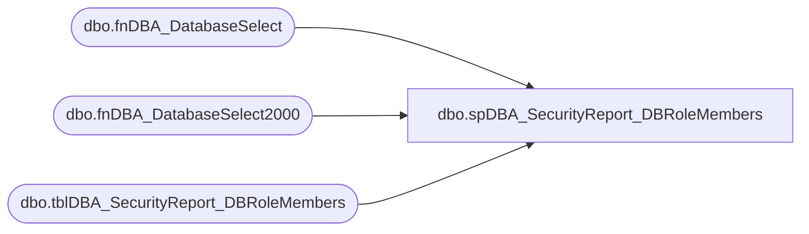

# dbo.spDBA_SecurityReport_DBRoleMembers

**Database:** DBAUtility  
**Server:** bedrockdb02  

## Architecture Diagram



## Table Dependencies

| Referenced Table |
|---|
| dbo.fnDBA_DatabaseSelect |
| dbo.fnDBA_DatabaseSelect2000 |
| dbo.tblDBA_SecurityReport_DBRoleMembers |

## Stored Procedure Code

```sql
CREATE PROCEDURE [dbo].[spDBA_SecurityReport_DBRoleMembers] 
	@Databases nvarchar(2000) = 'SYSTEM_DATABASES, USER_DATABASES', 
	@bolOutputToTable BIT = 0,
	@Action VARCHAR(20) = 'Process'
AS
-- =============================================================================================================
-- Name: spDBA_SecurityReport_DBRoleMembers
--
-- Description:	Returns database role membership.  Null membership indicates a role has no members.
--
-- Output: error logging.
-- 
-- Available actions:
--	@Databases:
--	E.g. SYSTEM_DATABASES
--	E.g. USER_DATABASES
--	E.g. Database1
--	E.g. Database1, Database2
--	E.g. USER_DATABASES, master
--	E.g. SYSTEM_DATABASES, -master
--	E.g. %Database%
--	E.g. %Database%, -Database1
--
--
-- Dependencies: 
--
-- Revision History
--		Name:			Date:			Comments:
--		Gary Derikito	07/20/2009		Create initial version
--		Gary Derikito	07/23/2009		Added 3 part naming to remaining tables.
--		Mike Pelikan	02/23/2012		Changed Logic to write to consolidated server reporting table
--		Mike Pelikan	06/27/2012		Modified for versioning
--										Added Comments
--
-- =============================================================================================================
DECLARE @Revision DATETIME
SET @Revision = '06/27/2012'

/*
exec spDBA_SecurityReport_DBRoleMembers @Databases = DBAUtility
exec spDBA_SecurityReport_DBRoleMembers @Databases = 'SYSTEM_DATABASES, USER_DATABASES'

*/
-- =============================================================================================================

----------------------------------------------------------------------------------------------------
--// Set options                                                                                //--
----------------------------------------------------------------------------------------------------
SET NOCOUNT ON

----------------------------------------------------------------------------------------------------
--// Revision                                                                                  //--
----------------------------------------------------------------------------------------------------
IF @Action = 'ReturnVersion'
BEGIN
	GOTO EndHere
END

----------------------------------------------------------------------------------------------------
--// Declare variables                                                                          //--
----------------------------------------------------------------------------------------------------

--  DECLARE @StartMessage nvarchar(max)
  DECLARE @EndMessage nvarchar(2000)
  DECLARE @DatabaseMessage nvarchar(2000)
  DECLARE @ErrorMessage nvarchar(2000)
  DECLARE @CurrentID int
  DECLARE @CurrentDatabase nvarchar(2000)
  DECLARE @CurrentTable nvarchar(2000)
  DECLARE @CurrentSchema nvarchar(128)
  DECLARE @CurrentCommand01 nvarchar(2000)
  DECLARE @CurrentCommandOutput01 int
  DECLARE @CreateDate datetime
  DECLARE @CurrentDate CHAR(8)
  DECLARE @tmpDatabases TABLE (ID int IDENTITY PRIMARY KEY,
                               DatabaseName nvarchar(2000),
                               Completed bit)

  DECLARE @Error int
  DECLARE @RowCount int
  DECLARE @ProductVersion	NVARCHAR(20) 
  DECLARE @SQL nvarchar(1000)
 
  SET @Error = 0
  SET @ProductVersion =  CAST(SERVERPROPERTY('productversion') AS VARCHAR)
  SET @CurrentDate = CONVERT(CHAR(8), GETDATE(), 112)


  IF object_id('tempdb..#RoleMembers') IS NOT NULL
	DROP TABLE #RoleMembers

  CREATE TABLE #RoleMembers (pk int IDENTITY PRIMARY KEY,
								dbname nvarchar(128),
								dbrolename nvarchar(128),
                               membername nvarchar(128),
                               membersid nvarchar(128))
  
  ----------------------------------------------------------------------------------------------------
  --// Log initial information                                                                    //--
  ----------------------------------------------------------------------------------------------------

--  SET @StartMessage = 'DateTime: ' + CONVERT(nvarchar,GETDATE(),120) + CHAR(13) + CHAR(10)
--  SET @StartMessage = @StartMessage + 'Server: ' + CAST(SERVERPROPERTY('ServerName') AS nvarchar) + CHAR(13) + CHAR(10)
--  SET @StartMessage = @StartMessage + 'Version: ' + CAST(SERVERPROPERTY('ProductVersion') AS nvarchar) + CHAR(13) + CHAR(10)
--  SET @StartMessage = @StartMessage + 'Edition: ' + CAST(SERVERPROPERTY('Edition') AS nvarchar) + CHAR(13) + CHAR(10)
--  SET @StartMessage = @StartMessage + 'Procedure: ' + QUOTENAME(DB_NAME(DB_ID())) + '.' + QUOTENAME(OBJECT_SCHEMA_NAME(@@PROCID)) + '.' + QUOTENAME(OBJECT_NAME(@@PROCID)) + CHAR(13) + CHAR(10)
--  SET @StartMessage = @StartMessage + 'Parameters: @Databases = ' + ISNULL('''' + REPLACE(@Databases,'''','''''') + '''','NULL')
--  SET @StartMessage = @StartMessage + ', @PhysicalOnly = ' + ISNULL('''' + REPLACE(@PhysicalOnly,'''','''''') + '''','NULL')
--  SET @StartMessage = @StartMessage + ', @NoIndex = ' + ISNULL('''' + REPLACE(@NoIndex,'''','''''') + '''','NULL')
--  SET @StartMessage = @StartMessage + CHAR(13) + CHAR(10)
--  SET @StartMessage = REPLACE(@StartMessage,'%','%%')
--  RAISERROR(@StartMessage,10,1) WITH NOWAIT

  ----------------------------------------------------------------------------------------------------
  --// Select databases                                                                           //--
  ----------------------------------------------------------------------------------------------------

  IF @Databases IS NULL OR @Databases = ''
  BEGIN
    SET @ErrorMessage = 'The value for parameter @Databases is not supported.' + CHAR(13) + CHAR(10)
    RAISERROR(@ErrorMessage,16,1) WITH LOG
    SET @Error = @@ERROR
  END


  IF SUBSTRING(@ProductVersion, 1, 1) = '8' --2000
	BEGIN
		INSERT INTO @tmpDatabases (DatabaseName, Completed)
		SELECT DatabaseName AS DatabaseName, 0 AS Completed
		FROM dbo.fnDBA_DatabaseSelect2000 (@Databases)
		ORDER BY DatabaseName ASC
		SET @RowCount = @@RowCount
	END
	ELSE --2005
	BEGIN
		--GOTO Crash---comment out because VS is checking for existence of object
		INSERT INTO @tmpDatabases (DatabaseName, Completed)
		SELECT DatabaseName AS DatabaseName, 0 AS Completed
		FROM dbo.fnDBA_DatabaseSelect (@Databases)
		ORDER BY DatabaseName ASC
		SET @RowCount = @@RowCount
	END

  IF @@ERROR <> 0 OR (@RowCount = 0 AND @Databases <> 'USER_DATABASES')
  BEGIN
    SET @ErrorMessage = 'Error selecting databases.' + CHAR(13) + CHAR(10)
    RAISERROR(@ErrorMessage,16,1) WITH LOG
    SET @Error = @@ERROR
  END

  ----------------------------------------------------------------------------------------------------
  --// Check input parameters                                                                     //--
  ----------------------------------------------------------------------------------------------------

  
  ----------------------------------------------------------------------------------------------------
  --// Check error variable                                                                       //--
  ----------------------------------------------------------------------------------------------------

  IF @Error <> 0 GOTO Crash

  ----------------------------------------------------------------------------------------------------
  --// Execute commands                                                                           //--
  ----------------------------------------------------------------------------------------------------

  WHILE EXISTS (SELECT * FROM @tmpDatabases WHERE Completed = 0)
  BEGIN --loop through databases

--select * from @tmpDatabases return

    SELECT TOP 1 @CurrentID = ID,
                 @CurrentDatabase = DatabaseName
    FROM @tmpDatabases
    WHERE Completed = 0
    ORDER BY ID ASC


    -- Set database message
    SET @DatabaseMessage = 'DateTime: ' + CONVERT(nvarchar,GETDATE(),120) + CHAR(13) + CHAR(10)
    SET @DatabaseMessage = @DatabaseMessage + 'Database: ' + QUOTENAME(@CurrentDatabase) + CHAR(13) + CHAR(10)
    SET @DatabaseMessage = @DatabaseMessage + 'Status: ' + CAST(DATABASEPROPERTYEX(@CurrentDatabase,'status') AS nvarchar) + CHAR(13) + CHAR(10)
    SET @DatabaseMessage = REPLACE(@DatabaseMessage,'%','%%')
--    RAISERROR(@DatabaseMessage,10,1) WITH NOWAIT

    IF DATABASEPROPERTYEX(@CurrentDatabase,'status') = 'ONLINE'
    BEGIN

		INSERT INTO #RoleMembers(dbname, dbrolename, membername, membersid)
		EXEC(

				'select ' + '''' + @CurrentDatabase + '''' + ', DbRole = g.name, MemberName = u.name, MemberSID = u.sid'
		+ ' from [' + @CurrentDatabase + '].dbo.sysusers g 
				left join [' + @CurrentDatabase + '].dbo.sysmembers m on (g.uid = m.groupuid)
				left join [' + @CurrentDatabase + '].dbo.sysusers u on (u.uid = m.memberuid)
		where   (g.issqlrole = 1)
				order by 1, 2'
			)


	END


	-- Update that the database is completed
    UPDATE @tmpDatabases
    SET Completed = 1
    WHERE ID = @CurrentID

    -- Clear variables
    SET @CurrentID = NULL
    SET @CurrentDatabase = NULL

    SET @CurrentCommand01 = NULL

    SET @CurrentCommandOutput01 = NULL
 
	
  END--loop through databases end

IF @bolOutputToTable = 1
	INSERT INTO COREDB01_MAINT.DBAUtilityMaster.dbo.tblDBA_SecurityReport_DBRoleMembers (InstanceName, DatabaseName, DBRoleName, MemberName)
	SELECT @@ServerName, dbname, DBRoleName, MemberName 
	FROM #RoleMembers 
	WHERE membername is not null
	ORDER BY dbname, dbrolename, membername
ELSE
	SELECT dbname, DBRoleName, MemberName 
	FROM #RoleMembers 
	WHERE membername is not null
	ORDER BY dbname, dbrolename, membername


  RETURN 0


  ----------------------------------------------------------------------------------------------------
  --// Log completing information                                                                 //--
  ----------------------------------------------------------------------------------------------------

  Crash:
  SET @EndMessage = 'DateTime: ' + CONVERT(nvarchar,GETDATE(),120) + ' Error with ' + OBJECT_NAME(@@PROCID)
  SET @EndMessage = REPLACE(@EndMessage,'%','%%')
  RAISERROR(@EndMessage,10,1) WITH Log

  ----------------------------------------------------------------------------------------------------
EndHere:
IF @Action = 'ReturnVersion'
BEGIN
	SELECT @Revision 
END
```

