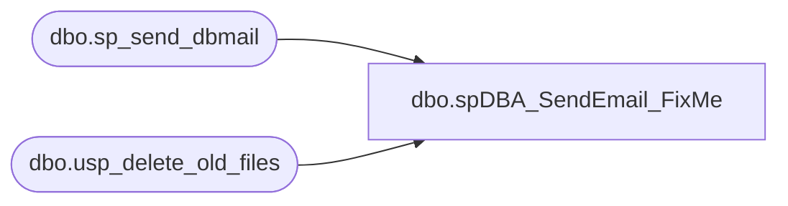

# dbo.spDBA_SendEmail_FixMe

**Database:** DBAUtility  
**Server:** bedrockdb02  

## Architecture Diagram



## Table Dependencies

| Referenced Table |
|---|
| dbo.sp_send_dbmail |
| dbo.usp_delete_old_files |

## Stored Procedure Code

```sql
CREATE PROCEDURE [dbo].[spDBA_SendEmail_FixMe]

@recipients NVARCHAR(MAX),
@copy_recipients NVARCHAR(MAX) = NULL,
@subject NVARCHAR(MAX) = 'DBA Maintenance Procedure Email',
@MessageTxt NVARCHAR(MAX) = NULL,
@AttachedHistFile VARCHAR(50) = NULL


AS
-- =============================================================================================================
-- Name: spDBA_SendEmail
--
-- Description:	Use to send email from remote servers.  The procedure is intended to run
-- on a repository server.  Using this procedure allows a remote server that does not have
-- email functionality to send email via the repository server. 
--
-- Output: error logging.
-- 
-- Available actions:
--	@recipients =  recipient of email
--	@copy_recipients = email address of those copied.
--	@subject = subject of email passed in from calling procedure.
--  @MessageTxt = message text of email passed in by calling procedure.
--	@AttachedHistFile = Allowable values are 'JOB_HIST', ...  If this is provided, the procedure will query the table and return the results as an attachment.

-- Dependencies: 
--	Papamart.dw.dbo.usp_delete_old_files
-- Revision History
--		Name:			Date:			Comments:
--		Gary Derikito	05/12/2009		Created initial version.
--		Gary Derikito	05/13/2009		Add optional file attaching capability
 	
/*
exec spDBA_SendEmail @recipients = 'garyd@buildabear.com'
exec spDBA_SendEmail @recipients = 'garyd@buildabear.com', @subject = 'Test'
exec spDBA_SendEmail @recipients = 'garyd@buildabear.com', @subject = 'Test', @MessageTxt = 'Test message body...'
exec spDBA_SendEmail @recipients = 'garyd@buildabear.com', @subject = 'Test', @MessageTxt = 'Test message body...', @AttachedHistFile = 'JOB_HIST'

exec spDBA_SendEmail @recipients = 'badnewsBear'

 
*/
-- =============================================================================================================

BEGIN

  ----------------------------------------------------------------------------------------------------
  --// Set options                                                                                //--
  ----------------------------------------------------------------------------------------------------

  SET NOCOUNT ON

  ----------------------------------------------------------------------------------------------------
  --// Declare variables                                                                          //--
  ----------------------------------------------------------------------------------------------------

 declare     @ac_path VARCHAR(100)

SET @ac_path = 'I:\Temp\Accounting\'

DECLARE @outputsql VARCHAR(4000),
        @bcpsql VARCHAR(4000),
		@cmd VARCHAR(4000),
		@filename VARCHAR(100),
		@ErrorMessage nvarchar(max),
		@Error int,
		@EndMessage nvarchar(max)


--select @recipients
--return
  
  ----------------------------------------------------------------------------------------------------
  --// Check input parameters                                                                     //--
  ----------------------------------------------------------------------------------------------------

  IF @recipients NOT LIKE '%@%' OR @recipients IS NULL
  BEGIN
    SET @ErrorMessage = 'The value for parameter @recipients is not supported.' + CHAR(13) + CHAR(10)
    RAISERROR(@ErrorMessage,16,1) WITH LOG
    SET @Error = @@ERROR
  END

  IF @copy_recipients NOT LIKE '%@%'
  BEGIN
    SET @ErrorMessage = 'The value for parameter @copy_recipients is not supported.' + CHAR(13) + CHAR(10)
    RAISERROR(@ErrorMessage,16,1) WITH LOG
    SET @Error = @@ERROR
  END

  IF @AttachedHistFile NOT IN ('JOB_HIST')
  BEGIN
    SET @ErrorMessage = 'The value for parameter @AttachedHistFile is not supported.' + CHAR(13) + CHAR(10)
    RAISERROR(@ErrorMessage,16,1) WITH LOG
    SET @Error = @@ERROR
  END

  
  ----------------------------------------------------------------------------------------------------
  --// Check error variable                                                                       //--
  ----------------------------------------------------------------------------------------------------

  IF @Error <> 0 GOTO Crash

  ----------------------------------------------------------------------------------------------------
  --// Execute commands                                                                           //--
  ----------------------------------------------------------------------------------------------------

IF @AttachedHistFile = 'JOB_HIST'
BEGIN
	SET @outputsql =
	+ ' select '  
	+ '  SERVER_NM' 
	+ ' , JOB_NM'
	+ ' , STEP_NM'
	+ ' , CAST(STEP_ID AS varchar(20))'
	+ ' , STEP_NM_HIST'
	+ ' , CAST(RUN_DT AS varchar(20))'
	+ ' , CAST(RUN_TM AS varchar(20))'
	+ ' , SQL_SEVERITY'
	+ ' , MESSAGE_TXT'
	+ ' , CAST(INSERT_DT as varchar(20))'
	+ ' from DBAUtility.dbo.JOB_HIST' 
	+ ' where datediff(day, INSERT_DT, getdate()) between -7 and 0'
	--select @outputsql

	SELECT  @filename = 'JOG_HIST' + '.txt'

	--select @filename
	--DELETE OLD FILES
	/*******************/
	-- set db name for production
	    EXEC [dw].dbo.usp_delete_old_files @path = @ac_path, @filemask = '*.txt',
	        @retention = 1
	/*******************/        

		SET @bcpsql = 'bcp "' + @outputsql + '" queryout "' + @ac_path + @filename
			+ '" -t "," -T -c'
		SET @bcpsql = 'bcp "' + @outputsql + '" queryout "' + @ac_path + @filename
			+ '" -t -T -c'

		EXEC master..xp_cmdshell @bcpsql
END

DECLARE @filelocation VARCHAR(100)
		
SET @filelocation = @ac_path + @filename
		
exec msdb.dbo.sp_send_dbmail 
@recipients=@recipients
,@copy_recipients=@copy_recipients
,@subject = @subject
,@query_result_separator = ','
,@file_attachments =  @filelocation
--,@ansi_attachment='TRUE'
,@body = @MessageTxt--'Message ...'

RETURN 0

  Crash:
  SET @EndMessage = 'DateTime: ' + CONVERT(nvarchar,GETDATE(),120) + ' Error with ' + OBJECT_NAME(@@PROCID)
  SET @EndMessage = REPLACE(@EndMessage,'%','%%')
  RAISERROR(@EndMessage,10,1) WITH LOG

END
```

