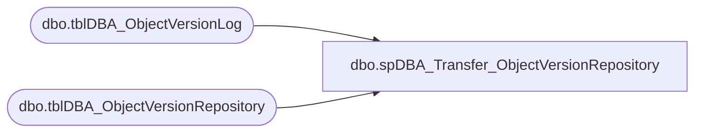

# dbo.spDBA_Transfer_ObjectVersionRepository

**Database:** DBAUtility  
**Server:** bedrockdb02  

## Architecture Diagram



## Table Dependencies

| Referenced Table |
|---|
| dbo.tblDBA_ObjectVersionLog |
| dbo.tblDBA_ObjectVersionRepository |

## Stored Procedure Code

```sql
CREATE PROC [dbo].[spDBA_Transfer_ObjectVersionRepository]

@Action VARCHAR(100) = 'Process'
AS

-- =============================================================================================================
-- Name: spDBA_Transfer_ProcVersionRepository
--
-- Description:	Inserts/Updates/delete stored procedure changes into central repository table.
-- Output: None

-- Available actions: None
--	
-- Dependencies: 
--	DBAUtility.dbo.tblDBA_ObjectVersionLog
--	COREDB01_MAINT.DBAUtilityMaster.dbo.tblDBA_ObjectVersionRepository
--
-- Revision History
--		Name:			Date:			Comments:
--		Mike Pelikan	06/27/2012		Initial Release
--		Mike Pelikan	08/02/2013		Trying to get around "Row handle referred to a deleted row 
--											or a row marked for deletion" error by using a table 
--											variable to hold all the id's of the COREDB01 table
--
DECLARE @Revision DATETIME
SET @Revision = '08/02/2013'
-----------------------------------------------------------------------------------------------------

----------------------------------------------------------------------------------------------------
--// Set options                                                                                //--
----------------------------------------------------------------------------------------------------
SET NOCOUNT ON

----------------------------------------------------------------------------------------------------
--// Declare variables                                                                          //--
----------------------------------------------------------------------------------------------------
DECLARE @EndMessage varchar(2000)
DECLARE @ReturnCode int

----------------------------------------------------------------------------------------------------
--// Revision                                                                                  //--
----------------------------------------------------------------------------------------------------
IF @Action = 'ReturnVersion'
BEGIN
	SELECT @Revision
END
ELSE
BEGIN

	--Update existing
	UPDATE COREDB01_MAINT.DBAUtilityMaster.dbo.tblDBA_ObjectVersionRepository
	SET VersionDate = pvl.VersionDate, usesRevision = pvl.usesRevision 
	FROM  COREDB01_MAINT.DBAUtilityMaster.dbo.tblDBA_ObjectVersionRepository pvr 
	INNER JOIN DBAUtility.dbo.tblDBA_ObjectVersionLog pvl ON pvr.InstanceName = pvl.InstanceName COLLATE SQL_Latin1_General_CP1_CI_AS 
	AND pvr.ObjectName = pvl.ObjectName COLLATE SQL_Latin1_General_CP1_CI_AS
	AND pvr.ObjectType = pvl.ObjectType COLLATE SQL_Latin1_General_CP1_CI_AS
	WHERE pvr.VersionDate <> pvl.VersionDate OR pvr.usesRevision <> pvl.usesRevision 
	--Insert New

	INSERT INTO COREDB01_MAINT.DBAUtilityMaster.dbo.tblDBA_ObjectVersionRepository (InstanceName, ObjectName, ObjectType, InstallDate, VersionDate, usesRevision)
	SELECT pvl.InstanceName, pvl.ObjectName, pvl.ObjectType, pvl.InstallDate, pvl.VersionDate, pvl.usesRevision
	FROM DBAUtility.dbo.tblDBA_ObjectVersionLog pvl 
	LEFT JOIN COREDB01_MAINT.DBAUtilityMaster.dbo.tblDBA_ObjectVersionRepository pvr ON pvl.InstanceName = pvr.InstanceName COLLATE SQL_Latin1_General_CP1_CI_AS 
	AND pvl.ObjectName = pvr.ObjectName COLLATE SQL_Latin1_General_CP1_CI_AS
	AND pvr.ObjectType = pvl.ObjectType COLLATE SQL_Latin1_General_CP1_CI_AS
	WHERE pvr.ProcVersionID IS NULL

	DECLARE @tblWorking TABLE (ProcVersionID INT)
	INSERT INTO @tblWorking
	SELECT pvr1.ProcVersionID
	FROM  COREDB01_MAINT.DBAUtilityMaster.dbo.tblDBA_ObjectVersionRepository pvr1
	INNER JOIN DBAUtility.dbo.tblDBA_ObjectVersionLog pvl ON pvr1.InstanceName = pvl.InstanceName COLLATE SQL_Latin1_General_CP1_CI_AS 
	AND pvr1.ObjectName = pvl.ObjectName COLLATE SQL_Latin1_General_CP1_CI_AS
	AND pvr1.ObjectType = pvl.ObjectType COLLATE SQL_Latin1_General_CP1_CI_AS
	WHERE pvr1.InstanceName = @@SERVERNAME
		
	--Delete old
	DELETE FROM COREDB01_MAINT.DBAUtilityMaster.dbo.tblDBA_ObjectVersionRepository 
	WHERE  InstanceName = @@SERVERNAME AND ProcVersionID NOT IN (
		SELECT ProcVersionID FROM @tblWorking)
END

EndHere:
IF @Action = 'ReturnVersion'
BEGIN
	SELECT @Revision 
END
ELSE
BEGIN
	SET @EndMessage = 'DateTime: ' + CONVERT(nvarchar,GETDATE(),120)
	SET @EndMessage = REPLACE(@EndMessage,'%','%%')
	RAISERROR(@EndMessage,10,1) WITH NOWAIT

	IF @ReturnCode <> 0
	BEGIN
		RETURN @ReturnCode
	--SELECT @ReturnCode
	END
END
```

