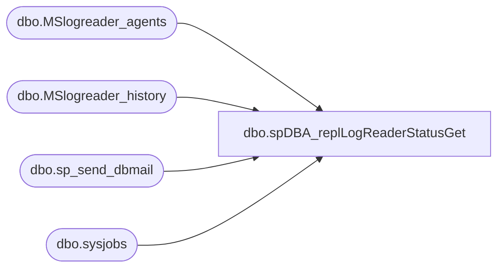

# dbo.spDBA_replLogReaderStatusGet

**Database:** DBAUtility  
**Server:** bedrockdb02  

## Architecture Diagram



## Table Dependencies

| Referenced Table |
|---|
| dbo.MSlogreader_agents |
| dbo.MSlogreader_history |
| dbo.sp_send_dbmail |
| dbo.sysjobs |

## Stored Procedure Code

```sql
CREATE   procedure [dbo].[spDBA_replLogReaderStatusGet]    
@pRecipients varchar(255) = 'databears@buildabear.com'  
AS  
 
-- =============================================================================================================
-- Name: spDBA_replLogReaderStatusGet
--
-- Description:	Checks the status of the LogReader job or jobs.  
-- Based on http://www.mssqltips.com/sqlservertip/1901/customized-alerts-for-sql-server-transactional-replication/
--
-- Output: 
-- 
-- Available actions:
-- @pRecipients:
--		email address of recipient of alert
--
-- Dependencies: 
--	Only to be used on servers with Replication 
--
-- Revision History
--		Name:			Date:			Comments:
--		Mike Pelikan	12/30/2013		Created
--		Mike Pelikan	01/03/2014		Added logic to look for distribution database, else use the 
--											custom databases
--
-- =============================================================================================================

  SET NOCOUNT ON
  SET TRANSACTION ISOLATION LEVEL READ UNCOMMITTED
  
  DECLARE @is_sysadmin INT  
  DECLARE @job_owner   sysname  
  DECLARE @job_id uniqueidentifier  
  DECLARE @job_name sysname  
  DECLARE @running int   
  DECLARE @cnt int  
  DECLARE @msg varchar(8000)  
  DECLARE @msg_header varchar(1000)  
  DECLARE @categoryid int   
    

IF (SELECT COUNT(*) FROM master.dbo.sysdatabases WHERE name = 'distribution')> 0 
BEGIN
	select la.name,la.publisher_db,  
	case lh.runstatus  
	when 1 then 'Start'  
	when 2 then 'Succeed'  
	when 3 then 'In progress'  
	when 4 then 'Idle'  
	when 5 then 'Retry'  
	when 6 then 'Fail'  
	else 'Unknown'  
	end as runstatus  
	, lh.time, lh.comments  
	from distribution..MSlogreader_history lh   
	inner join distribution..MSlogreader_agents la on lh.agent_id = la.id  
	inner join (   
	select lh.agent_id, max(lh.time) as LastTime  
	from distribution..MSlogreader_history lh   
	inner join distribution..MSlogreader_agents la on lh.agent_id = la.id  
	group by lh.agent_id) r   
	on r.agent_id = lh.agent_id  
	and r.LastTime = lh.time  
	where lh.runstatus not in (3,4) -- 3:In Progress, 4: Idle  
END
ELSE
BEGIN
	select la.name,la.publisher_db,  
	case lh.runstatus  
		when 1 then 'Start'  
		when 2 then 'Succeed'  
		when 3 then 'In progress'  
		when 4 then 'Idle'  
		when 5 then 'Retry'  
		when 6 then 'Fail'  
		else 'Unknown'  
	end as runstatus, lh.time, lh.comments  
	from FusionRoomView_distribution..MSlogreader_history lh   
	inner join FusionRoomView_distribution..MSlogreader_agents la on lh.agent_id = la.id  
	inner join (   
		select lh.agent_id, max(lh.time) as LastTime  
		from FusionRoomView_distribution..MSlogreader_history lh   
		inner join FusionRoomView_distribution..MSlogreader_agents la on lh.agent_id = la.id  
		group by lh.agent_id
	) r  on r.agent_id = lh.agent_id and r.LastTime = lh.time  
	where lh.runstatus not in (3,4) -- 3:In Progress, 4: Idle  
	UNION  
	select la.name,la.publisher_db,  
	case lh.runstatus  
		when 1 then 'Start'  
		when 2 then 'Succeed'  
		when 3 then 'In progress'  
		when 4 then 'Idle'  
		when 5 then 'Retry'  
		when 6 then 'Fail'  
		else 'Unknown'  
	end as runstatus, lh.time, lh.comments  
	from RoomView_distribution..MSlogreader_history lh   
	inner join RoomView_distribution..MSlogreader_agents la on lh.agent_id = la.id  
	inner join (   
		select lh.agent_id, max(lh.time) as LastTime  
		from RoomView_distribution..MSlogreader_history lh   
		inner join RoomView_distribution..MSlogreader_agents la on lh.agent_id = la.id  
		group by lh.agent_id
	) r  on r.agent_id = lh.agent_id and r.LastTime = lh.time  
	where lh.runstatus not in (3,4) -- 3:In Progress, 4: Idle  
END

if @@rowcount > 0    
  
BEGIN  
  SELECT  @job_owner =   SUSER_SNAME()  
         ,@is_sysadmin = 1   
         ,@running = 0  
         ,@categoryid = 13 -- LogReader jobs  
  
  CREATE TABLE #job (job_id  UNIQUEIDENTIFIER NOT NULL,  
                    last_run_date         INT ,  
                    last_run_time         INT ,  
                    next_run_date         INT ,  
                    next_run_time         INT ,  
                    next_run_schedule_id  INT ,  
                    requested_to_run      INT ,   
                    request_source        INT ,  
                    request_source_id     sysname COLLATE database_default NULL,  
                    running               int ,  
                    current_step          INT ,  
                    current_retry_attempt INT ,  
                    job_state             INT)  
  
      INSERT INTO #job  
      EXECUTE master.dbo.xp_sqlagent_enum_jobs @is_sysadmin, @job_owner--, @job_id   
    
      SELECT @running = isnull(sum(j.running),-1),@cnt = count(*)   
      FROM #job j  
      join msdb..sysjobs s on j.job_id = s.job_id  
      where category_id = @categoryid -- logreader jobs  
  
 if @running <> @cnt  
 BEGIN  
  SELECT @msg_header = 'LogReader job(s) FAILING OR STOPPED. Please check replication job(s) ASAP.'  
  SELECT @msg_header = @msg_header + char(10)   
  SELECT @msg_header = @msg_header + '************************************************************************'   

  set @msg = ''    
  SELECT @msg = @msg + char(10)+'"' + s.[name] + '" - '+ convert(varchar, isnull(j.running,-1))  
  FROM #job j  
  join msdb..sysjobs s on j.job_id = s.job_id  
  where category_id = @categoryid  
  and isnull(j.running,-1) <> 1  
    
  SELECT @msg = @msg_header + char(10) + nullif(@msg,'')  
     
  if @@version like 'Microsoft SQL Server  2000%'  
     exec master.dbo.xp_sendmail                     
     @recipients= @pRecipients , --'youremail@yourcompany.com',  
     @subject='Production Replication LogReader Alert',  
     @message = @msg,  
       @width = 100    
  else   
    exec msdb.dbo.sp_send_dbmail --@profile_name = 'SQLMail Profile',                     
     @recipients= @pRecipients , --'youremail@yourcompany.com',  
     @subject= 'Production Replication LogReader Alert',  
     @body = @msg   
 END  
  
END
```

