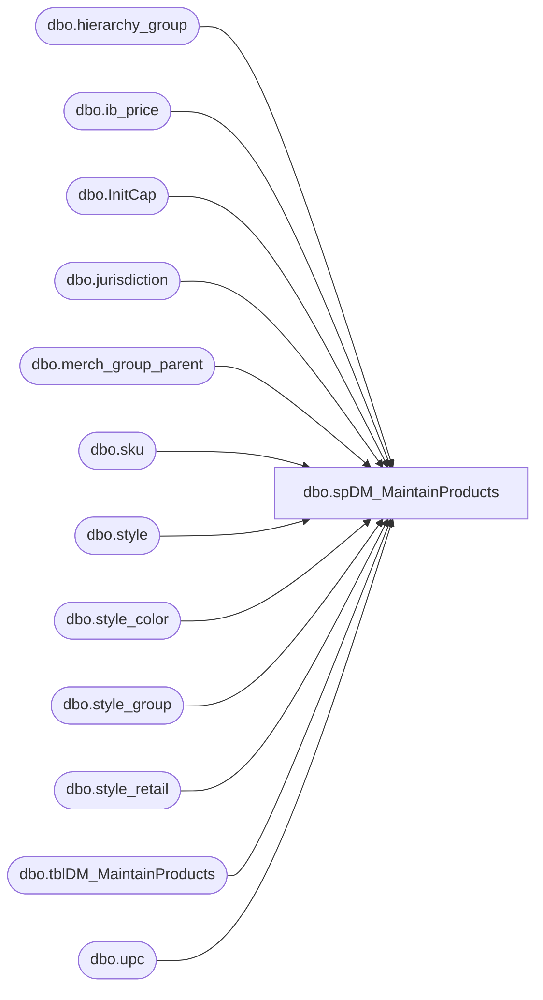

# dbo.spDM_MaintainProducts

**Database:** DBAUtility  
**Server:** bedrockdb02  

## Architecture Diagram



## Table Dependencies

| Referenced Table |
|---|
| dbo.hierarchy_group |
| dbo.ib_price |
| dbo.InitCap |
| dbo.jurisdiction |
| dbo.merch_group_parent |
| dbo.sku |
| dbo.style |
| dbo.style_color |
| dbo.style_group |
| dbo.style_retail |
| dbo.tblDM_MaintainProducts |
| dbo.upc |

## Stored Procedure Code

```sql
CREATE PROC [dbo].[spDM_MaintainProducts] 
@Action VARCHAR(20) = 'CREATE'
--WITH EXECUTE AS 'dbo'
WITH EXECUTE AS 'DiscountMasterUser'
AS

-- =============================================================================================================
-- Name: spDM_MaintainProducts
--
-- Description:	Populates table used by BIDB01.DiscountMstrData.dbo.spMaintainProducts
--
-- Output: Error logging.
-- 
-- Available actions: 
--
-- @Action:
--	'ReturnVersion' = Do not do anything but return the version of the objects
--	'CREATE' = TRUNCATE then populate tblDM_MaintainProducts
--	'DROP' = just TRUNCATE tblDM_MaintainProducts
--
-- Dependency: 
--	OURSMERCHDB01.me_01 tables
--
-- Revision History
--		Name:			Date:			Comments:
--		Mike Pelikan	10/26/2012		Creation
--		Mike Pelikan	05/01/2013		Modified to use OURSMERCHDB01.dbautility.dbo.spDM_MaintainProducts
--		Mike Pelikan	05/07/2013		spDM_MaintainProducts wouldn't work in a job, moved logic to this proc.
--		Mike Pelikan	05/28/2013		Removed OURSMERCHDB01.me_01.dbo.vwDW_Product_Dim logic
--		Mike Pelikan	07/31/2013		Commented out logic that excluded IE products (EURO Pricing) from showing up.
--		Mike Pelikan	08/08/2013		As Per RobynD, filtered out records that weren't sold in a particular jurisdiction
--										As per MarkD, removed France
--		Mike Pelikan	08/14/2013		As per MarkD and RobynD, R-B-Z products can be duplicated
-- =============================================================================================================
DECLARE @Revision DATETIME
SET @Revision = '08/14/2013'
/*
DECLARE @Action VARCHAR(15)
SET @Action = 'Process'

exec spMaintainProducts

*/
-- =============================================================================================================

----------------------------------------------------------------------------------------------------
--// Set options                                                                                //--
----------------------------------------------------------------------------------------------------
SET NOCOUNT ON

----------------------------------------------------------------------------------------------------
--// Revision                                                                                  //--
----------------------------------------------------------------------------------------------------
IF @Action = 'ReturnVersion'
BEGIN
	GOTO EndHere
END
SET NOCOUNT ON 
TRUNCATE TABLE DBAUtility.dbo.tblDM_MaintainProducts

IF @Action = 'CREATE'
BEGIN

SELECT * 
INTO #keith_max_ib_price
FROM (
	SELECT s.style_code, s.short_desc, ip.jurisdiction_id, max(ib_price_id) as ib_price_id	
	FROM me_01.dbo.style s WITH (NOLOCK) 
	INNER JOIN me_01.dbo.style_retail sr WITH (NOLOCK) ON s.style_id = sr.style_id
	INNER JOIN me_01.dbo.ib_price ip WITH (NOLOCK) ON s.style_id = ip.style_id AND sr.jurisdiction_id = ip.jurisdiction_id
	INNER JOIN me_01.dbo.style_group sg WITH (NOLOCK) ON s.style_id=sg.style_id 
	INNER JOIN me_01.dbo.hierarchy_group hgsub WITH (NOLOCK) ON sg.hierarchy_group_id=hgsub.hierarchy_group_id 

	WHERE 
		CAST(CONVERT(VARCHAR, GETDATE(),101)AS DATETIME) BETWEEN CAST(CONVERT(VARCHAR, ip.start_date ,101)AS DATETIME) 
		AND ISNULL(CAST(CONVERT(VARCHAR, ip.end_date ,101)as datetime), CAST(CONVERT(VARCHAR, GETDATE() ,101)AS DATETIME))
		AND ip.cancel_promo_flag <> 1
		AND ip.location_id is null
	AND 
	(
		(ip.jurisdiction_id IN 	 (2,5,7) AND LEFT(style_code, 1) = '4') 
	OR
		(ip.jurisdiction_id = 	 (3) AND LEFT(style_code, 1) = '1') 
	OR
		(ip.jurisdiction_id = 	 (8) AND LEFT(style_code, 1) = '8') 
	OR 
		(ip.jurisdiction_id NOT IN  (2,3,4,5,7,8) AND LEFT(style_code, 1) NOT IN ('1','4','8')) 
	)
	AND hierarchy_group_code NOT LIKE 'R-B-Z%'
	
	GROUP BY s.style_code,s.short_desc,ip.jurisdiction_id
UNION
	SELECT s.style_code, s.short_desc, ip.jurisdiction_id, max(ib_price_id) as ib_price_id	
	--INTO #keith_max_ib_price
	FROM me_01.dbo.style s WITH (NOLOCK) 
	INNER JOIN me_01.dbo.style_retail sr WITH (NOLOCK) ON s.style_id = sr.style_id
	INNER JOIN me_01.dbo.ib_price ip WITH (NOLOCK) ON s.style_id = ip.style_id AND sr.jurisdiction_id = ip.jurisdiction_id
	INNER JOIN me_01.dbo.style_group sg WITH (NOLOCK) ON s.style_id=sg.style_id 
	INNER JOIN me_01.dbo.hierarchy_group hgsub WITH (NOLOCK) ON sg.hierarchy_group_id=hgsub.hierarchy_group_id 

	WHERE 
		CAST(CONVERT(VARCHAR, GETDATE(),101)AS DATETIME) BETWEEN CAST(CONVERT(VARCHAR, ip.start_date ,101)AS DATETIME) 
		AND ISNULL(CAST(CONVERT(VARCHAR, ip.end_date ,101)as datetime), CAST(CONVERT(VARCHAR, GETDATE() ,101)AS DATETIME))
		AND ip.cancel_promo_flag <> 1
		AND ip.location_id is null
	AND hierarchy_group_code LIKE 'R-B-Z%'
	
	GROUP BY s.style_code,s.short_desc,ip.jurisdiction_id
) qry


--comment this out once you figure out the duplicate styles for the R-B-Z group
	--SELECT s.style_code, s.short_desc, ip.jurisdiction_id, max(ib_price_id) as ib_price_id	
	--into #keith_max_ib_price
	--from me_01.dbo.style s,
	--	me_01.dbo.ib_price ip
	--where s.style_id = ip.style_id
	--	and cast(convert(varchar, getdate(),101)as datetime) between cast(convert(varchar, ip.start_date ,101)as datetime) and isnull(cast(convert(varchar, ip.end_date ,101)as datetime), cast(convert(varchar, getdate() ,101)as datetime))
	--	and ip.cancel_promo_flag <> 1
	--	and ip.location_id is null
	--	and ip.jurisdiction_id <> 4
	--group by s.style_code,s.short_desc,ip.jurisdiction_id
----
	INSERT INTO DBAUtility.dbo.tblDM_MaintainProducts
	SELECT DISTINCT 
	REPLACE(jurisdiction_code,'HOME','US') jurisdiction_code,	
	j.jurisdiction_id,
	
	
		left(hgsub.hierarchy_group_code,8) as hg_code, s.style_code, s.short_desc, CAST(upc.upc_number AS BIGINT) AS sku,
		  CAST(hgsub.hierarchy_group_code AS VARCHAR(20)) AS subclass_code, 
		  CAST(me_01.dbo.InitCap(hgsub.hierarchy_group_short_label) AS VARCHAR(20)) AS subclass, 
		  CAST(me_01.dbo.InitCap(hgcla.hierarchy_group_short_label) AS VARCHAR(20)) AS class, 
		  CAST(me_01.dbo.InitCap(hgdep.hierarchy_group_short_label) AS VARCHAR(20)) AS department, 
		  CAST(me_01.dbo.InitCap(hgdep.hierarchy_group_code) AS VARCHAR(20)) AS department_code, 
		  CAST(me_01.dbo.InitCap(hgdiv.hierarchy_group_short_label) AS VARCHAR(20)) AS division, 
		case when ip.end_date is null
			then null
			else ip.document_number
		end as document_number,
		case when ip.end_date is null
			then null
			else ip.start_date
		end as start_date,
		ip.end_date,
		case when ip.end_date is null
			then null
			else ip.selling_retail_price
		end as selling_retail_price,
		sr.current_selling_retail, sr.original_selling_retail, ip.ib_price_id, s.style_id, sku.sku_id
		FROM me_01.dbo.style_color sc  WITH (NOLOCK)
		INNER JOIN me_01.dbo.style s WITH (NOLOCK) ON sc.style_id=s.style_id  
		INNER JOIN me_01.dbo.ib_price ip ON s.style_id = ip.style_id
		INNER JOIN me_01.dbo.jurisdiction j ON ip.jurisdiction_id = j.jurisdiction_id
		INNER JOIN me_01.dbo.sku  WITH (NOLOCK) ON sku.style_color_id=sc.style_color_id
		INNER JOIN me_01.dbo.upc WITH (NOLOCK) ON sku.sku_id=upc.sku_id  and upc.upc_number < '000001000000'    
		INNER JOIN me_01.dbo.style_group sg WITH (NOLOCK) ON sc.style_id=sg.style_id 
		INNER JOIN me_01.dbo.merch_group_parent mgp WITH (NOLOCK) ON sg.hierarchy_group_id=mgp.hierarchy_group_id 
		INNER JOIN me_01.dbo.hierarchy_group hgsub WITH (NOLOCK) ON mgp.parent_hierarchy_group_id=hgsub.hierarchy_group_id 
		INNER JOIN me_01.dbo.hierarchy_group hgcla WITH (NOLOCK) ON hgsub.parent_group_id = hgcla.hierarchy_group_id
		INNER JOIN me_01.dbo.hierarchy_group hgdep WITH (NOLOCK) ON hgcla.parent_group_id=hgdep.hierarchy_group_id 
		INNER JOIN me_01.dbo.hierarchy_group hgdiv WITH (NOLOCK) ON hgdep.parent_group_id=hgdiv.hierarchy_group_id 
		INNER JOIN me_01.dbo.style_retail sr ON s.style_id = sr.style_id AND sr.jurisdiction_id = ip.jurisdiction_id
		INNER JOIN #keith_max_ib_price kmip ON ip.ib_price_id = kmip.ib_price_id AND ip.jurisdiction_id = kmip.jurisdiction_id
		WHERE hgsub.hierarchy_id = 1 AND hgcla.hierarchy_id = 1 AND hgdep.hierarchy_id = 1 AND hgdiv.hierarchy_id = 1 
		AND hgsub.hierarchy_level_id = 10000007 /*8    */ AND hgcla.hierarchy_level_id = 10000006 /*7*/ 
		AND hgdep.hierarchy_level_id = 10000005 /*6     */ AND hgdiv.hierarchy_level_id = 10000004 /*5     */ 
		AND len(upc_number) = 12 AND s.style_code = substring(upc_number, 7, 6) AND s.style_code NOT IN ('000450', '001857', '004422')
		--AND 	j.jurisdiction_id = CASE		WHEN isnumeric(s.style_code) != 1 then 1
		--WHEN cast(s.style_code AS BIGINT) BETWEEN 100000 AND 199999 THEN  3
		--WHEN cast(s.style_code AS BIGINT) BETWEEN 400000 AND 499999 THEN 2
		--ELSE 1 END
END

EndHere:
IF @Action = 'ReturnVersion'
BEGIN
	SELECT @Revision 
END
```

