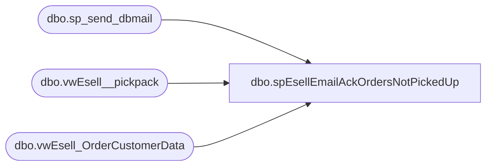

# dbo.spEsellEmailAckOrdersNotPickedUp

**Database:** DBAUtility  
**Server:** bedrockdb02  

## Architecture Diagram



## Table Dependencies

| Referenced Table |
|---|
| dbo.sp_send_dbmail |
| dbo.vwEsell__pickpack |
| dbo.vwEsell_OrderCustomerData |

## Stored Procedure Code

```sql
CREATE proc spEsellEmailAckOrdersNotPickedUp

as 

-- =====================================================================================================
-- Name: spEsellEmailAckOrdersNotPickedUp
--
--Description: Sends email to BSRFollowup@buildabear.com with list of orders not picked up after 7 days of being acknowledged in Enterprise Selling system
--				
-- Revision History
--		Name:			Date:			Comments:
--		Dan Tweedie		2017-01-27		Created proc
-- =====================================================================================================

set nocount on

IF (Object_ID('tempdb..#orders') IS NOT NULL) DROP TABLE #orders
select 
	oc.*
into #orders
from vwEsell_OrderCustomerData oc --this view shows order customer name, phone and email
join vwEsell__pickpack op on oc.order_id = op.order_id --this view shows orders that were 'acknowledged' but haven't been picked up after 7 days

if (select count(*) from #orders) > 0

begin

	declare
		@body nvarchar(max),
		@footer varchar(1000),
		@subj varchar(1000)

	select @body = 
			'<font face = arial size = 4> <B>Enterprise Selling Orders - Acknowledged, not Picked Up after 7 Days </font>' + 
			'<BR>' +
			'<table border="1">' +
			'<font face =arial size = 2>' +
			'<tr>
				<th>ORDER ID</th>
				<th>CUSTOMER <BR>NAME <BR>(BILLED)</th>
				<th>CUSTOMER <BR>DAY PHONE <BR>(BILLED)</th>
				<th>CUSTOMER <BR>EVE PHONE <BR>(BILLED)</th>
				<th>CUSTOMER <BR>EMAIL <BR>(BILLED)</th>
				<th>CUSTOMER <BR>NAME <BR>(RECIPIENT)</th>
				<th>CUSTOMER <BR>DAY PHONE <BR>(RECIPIENT)</th>
				<th>CUSTOMER <BR>EVE PHONE <BR>(RECIPIENT)</th>
				<th>CUSTOMER <BR>EMAIL <BR>(RECIPIENT)</th>'+
				CAST ( ( SELECT 
								td = order_id, '',
								td = BillingFirstName + ' ' + BillingLastName, '', 
								td = BillingDayPhone, '',
								td = BillingEveningPhone, '',
								td = BillingEmail, '',
								td = FulfillmentFirstName + ' ' + FulfillmentLastName, '',
								td = FulfillmentDayPhone, '',
								td = FulfillmentEveningPhone, '',
								td = FulfillmentEmail, ''
							from #orders
							order by order_id
							FOR XML PATH('tr'), TYPE 
				) AS NVARCHAR(MAX) ) +
				'</font></table></font></p></p>
				<br>'

			select @Footer = 'This report was generated by Papamart.DWStaging.dbo.spFlashGaapSalesEmailSummary. <br>
									  The information in this message may be privileged, “confidential” and protected from disclosure and/or intended only for the addressee(s) named above. If the reader of this message is not the intended recipient, or an employee or agent responsible for delivering this message to the intended recipient, you are hereby notified that any dissemination, distribution or copying of the communication is strictly prohibited. If you have received this communication in error, please notify us immediately by replying to the message and deleting it from your computer. Thank you beary much.'

			
			select @body = @body + @footer

			select @subj = 'Enterprise Selling Orders - Acknowledged, not Picked Up after 7 Days'
		
			exec msdb.dbo.sp_send_dbmail
			@profile_name = 'MerchAdmin',
			@recipients = 'BSRFollowup@buildabear.com',
			@body = @body,
			@subject= @subj,
			@body_format = 'HTML'

end
```

