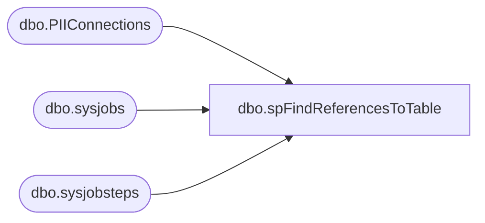

# dbo.spFindReferencesToTable

**Database:** DBAUtility  
**Server:** bedrockdb02  

## Architecture Diagram



## Table Dependencies

| Referenced Table |
|---|
| dbo.PIIConnections |
| dbo.sysjobs |
| dbo.sysjobsteps |

## Stored Procedure Code

```sql
-- =============================================
-- Author:		Tim Bytnar
-- Create date: 2/2/2018
-- Description:	This stored proc will search all Stored Procedures, Views and Jobs for references to a given table
-- =============================================
CREATE PROCEDURE spFindReferencesToTable
	@TableName varchar(100)
AS
BEGIN

	SET NOCOUNT ON;

    -- Just set the keyword default to what you're looking for
	DECLARE @keyword varchar(250) = @TableName
	DECLARE @jobkeyword varchar(250)
	DECLARE @results table (objectType varchar(32), dbname varchar(64), objectName varchar(64), objectDefinition varchar(MAX))
	SET @keyword = '''%' + @keyword + '%''';
	SET @jobkeyword = '%' + @keyword + '%'

	-- search the jobs for a specific text 
	INSERT INTO @results (objectType, dbname, objectName, objectDefinition)
	SELECT 'Agent Job' as objectType,
		'Agent Jobs' as dbname,
		(j.name + ' - Step ' + CAST(js.step_id as varchar(15))) as objectName,
		js.command as objectDefinition
	FROM	msdb.dbo.sysjobs j
	JOIN	msdb.dbo.sysjobsteps js
		ON	js.job_id = j.job_id 
	WHERE	js.command LIKE @jobkeyword

	-- search all stored procs and views in all databases for a specific keyword
	DECLARE @dbname nvarchar(123)
	, @id int
	, @max int
	, @cmdSearch nvarchar(max)

	IF OBJECT_ID('tempdb..#db_list') IS NOT NULL
		DROP TABLE #db_list

	CREATE TABLE #db_list
	(
		id int identity (1,1)
		, dbname nvarchar(123)
	);

	IF OBJECT_ID('tempdb..#dbs_storedprocs') IS NOT NULL
		DROP TABLE #dbs_storedprocs
	IF OBJECT_ID('tempdb..#dbs_views') IS NOT NULL
		DROP TABLE #dbs_views

	CREATE TABLE #dbs_storedprocs
	(
		dbname nvarchar(123),
		storedproc_name nvarchar(250),
		storeproc_definition nvarchar(max)
	);

	CREATE TABLE #dbs_views
	(
		dbname nvarchar(123),
		view_name nvarchar(250),
		view_definition nvarchar(max)
	);

	INSERT INTO #db_list
	SELECT db.name
	FROM sys.databases db
	WHERE db.state = 0;

	SELECT @id = 1, @max = max(id)
	FROM #db_list

	WHILE (@id <= @max)
	BEGIN
		SELECT @dbname = dbname
		FROM #db_list
		WHERE id = @id;

		SET @cmdSearch = 'USE ' +@dbname+
			' SELECT DB_NAME(), 
					OBJECT_NAME(object_id), 
					OBJECT_DEFINITION(object_id) 
			 FROM sys.procedures
			 WHERE OBJECT_DEFINITION(object_id) LIKE ' + @keyword;

		INSERT INTO #dbs_storedprocs
		EXEC (@cmdSearch);

		SET @cmdSearch = 'SELECT TABLE_CATALOG,
							  TABLE_NAME,
							  VIEW_DEFINITION						
						  FROM INFORMATION_SCHEMA.VIEWS WHERE VIEW_DEFINITION like ' + @keyword;
		INSERT INTO #dbs_views
		EXEC (@cmdSearch);

		SET @id = @id + 1;
	END

	INSERT INTO @results (objectType, dbname, objectName, objectDefinition)
	SELECT 'StoredProc' as objectType,
		dbname  AS dbname,
		storedproc_name  AS objectName,
		storeproc_definition AS objectDefinition
	FROM #dbs_storedprocs 

	INSERT INTO @results (objectType, dbname, objectName, objectDefinition)
	SELECT 'View' as objectType,
		dbname  AS dbname,
		view_name  AS objectName,
		view_definition AS objectDefinition
	FROM #dbs_views 

	IF EXISTS (SELECT * FROM @results)
		BEGIN
			INSERT INTO COREDB01_MAINT.GDPRTracking.dbo.PIIConnections
			SELECT @@SERVERNAME,
				   dbname,
				   @TableName,
				   objectType,
				   objectName,
				   objectDefinition
			 FROM @results
		END
	ELSE
		BEGIN
			INSERT INTO COREDB01_MAINT.GDPRTracking.dbo.PIIConnections
			SELECT @@SERVERNAME,
				   NULL,
				   @TableName,
				   'NONE',
				   'NONE',
				   'NONE'
		END
END
```

