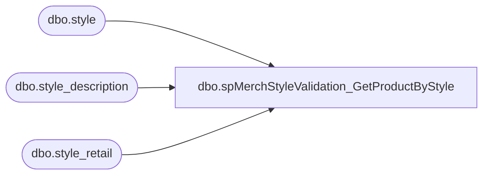

# dbo.spMerchStyleValidation_GetProductByStyle

**Database:** DBAUtility  
**Server:** bedrockdb02  

## Architecture Diagram



## Table Dependencies

| Referenced Table |
|---|
| dbo.style |
| dbo.style_description |
| dbo.style_retail |

## Stored Procedure Code

```sql
CREATE PROCEDURE [dbo].[spMerchStyleValidation_GetProductByStyle] 
	@styleCode AS VARCHAR(6)
AS
BEGIN

-- =============================================================================================================
-- Name: [dbo].[spMerchStyleValidation_GetProductByStyle] 
--
-- Description:	Product information from the given Style Code is returned.
--
-- Input: Style Code
--
-- Output: N/A
--
-- Dependencies: 
--
-- Revision History
--		Name:			Date:			Comments:
--		Ben Barud		04/25/2016		created
-- =============================================

	SET NOCOUNT ON;

	--DECLARE @styleCode AS VARCHAR(6)
	--SET @styleCode = '129063'

	SELECT s.style_code,
	  s.short_desc,
	  CASE WHEN s.style_code BETWEEN '400000' AND '699999' THEN sr_uk.current_selling_retail
	    ELSE NULL
	  END AS retail_vat,
	  CASE WHEN s.style_code BETWEEN '100000' AND '199999' THEN sr_can.current_selling_retail
	    WHEN s.style_code BETWEEN '400000' AND '699999' THEN NULL
	    WHEN s.style_code BETWEEN '800000' AND '899999' THEN sr_yuan.current_selling_retail
	    ELSE sr_us.current_selling_retail
	  END AS Selling_Retail,
	  CASE WHEN s.style_code BETWEEN '400000' AND '699999' THEN sr_euro.current_selling_retail
	    ELSE NULL
	  END AS Euro,
	  --CASE WHEN s.style_code BETWEEN '400000' AND '499999'
      CASE WHEN s.style_code BETWEEN '400000' AND '699999' THEN sr_krone.current_selling_retail
	    ELSE NULL
	  END AS Krone,
	  CASE WHEN s.style_code BETWEEN '800000' AND '899999' THEN sd_cn.long_desc 
	    ELSE sd_fr.long_desc 
	  END AS French_Desc
	FROM me_01.dbo.style s WITH(NOLOCK)
	LEFT JOIN me_01.dbo.style_retail sr_us WITH(NOLOCK) ON s.style_id = sr_us.style_id AND sr_us.jurisdiction_id = 1
	LEFT JOIN me_01.dbo.style_retail sr_uk WITH (NOLOCK) ON s.style_id = sr_uk.style_id AND sr_uk.jurisdiction_id = 2
	LEFT JOIN me_01.dbo.style_retail sr_can WITH (NOLOCK) ON s.style_id = sr_can.style_id AND sr_can.jurisdiction_id = 3
	LEFT JOIN me_01.dbo.style_retail sr_euro WITH (NOLOCK) ON s.style_id = sr_euro.style_id AND sr_euro.jurisdiction_id = 5
	LEFT JOIN me_01.dbo.style_retail sr_krone WITH (NOLOCK) ON s.style_id = sr_krone.style_id AND sr_krone.jurisdiction_id = 7
	LEFT JOIN me_01.dbo.style_retail sr_yuan WITH (NOLOCK) ON s.style_id = sr_yuan.style_id AND sr_yuan.jurisdiction_id = 8
	LEFT JOIN me_01.dbo.style_description sd_fr WITH (NOLOCK) ON s.style_id = sd_fr.style_id AND sd_fr.language_id = 100002
	LEFT JOIN me_01.dbo.style_description sd_cn WITH (NOLOCK) ON s.style_id = sd_cn.style_id AND sd_cn.language_id = 100006
	WHERE s.style_code IN (@styleCode)
END
```

