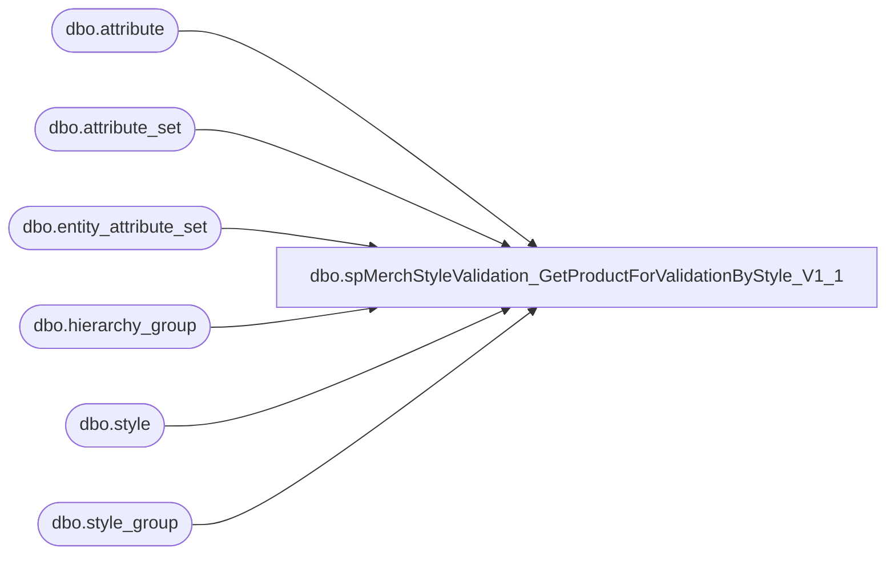

# dbo.spMerchStyleValidation_GetProductForValidationByStyle_V1_1

**Database:** DBAUtility  
**Server:** bedrockdb02  

## Architecture Diagram



## Table Dependencies

| Referenced Table |
|---|
| dbo.attribute |
| dbo.attribute_set |
| dbo.entity_attribute_set |
| dbo.hierarchy_group |
| dbo.style |
| dbo.style_group |

## Stored Procedure Code

```sql
CREATE PROCEDURE [dbo].[spMerchStyleValidation_GetProductForValidationByStyle_V1_1] 
	@styleCode AS VARCHAR(6)
AS
BEGIN

-- =============================================================================================================
-- Name: [dbo].[spMerchStyleValidation_GetProductForValidationByStyle] 
--
-- Description:	Product information from the given Style Code is returned.
--
-- Input: Style Code
--
-- Output: N/A
--
-- Dependencies: 
--
-- Revision History
--		Name:			Date:			Comments:
--		Ben Barud		04/26/2016		created
-- =============================================

	SET NOCOUNT ON;

	--DECLARE @styleCode AS VARCHAR(6)
	--SET @styleCode = '823042'

	SELECT s.style_code as styleCode
		  ,hg4.hierarchy_group_code as division
		  ,att.attribute_set_label as ownership 
		  ,max(A.US) AVAILB_US
		  ,max(A.CA) AVAILB_CA
		  ,max(A.UK) AVAILB_UK
		  ,max(A.CN) AVAILB_CN
		  ,max(A.INTL) AVAILB_INTL
		  ,max(A.USWEB) AVAILB_USWEB
		  ,max(A.UKWEB) AVAILB_UKWEB
		  ,max(A.DINO) AVAILB_DINO
		  --,CASE WHEN ecpid.custom_property_value IS NULL THEN '1/1/2000' WHEN ecpid.custom_property_value LIKE '%JANUARY%' THEN '1/1/' + CAST(DATEPART(YEAR, 
    --                     GETDATE()) AS VARCHAR) WHEN ecpid.custom_property_value LIKE '%FEBRUARY%' THEN '2/1/' + CAST(DATEPART(YEAR, GETDATE()) AS VARCHAR) 
    --                     WHEN ecpid.custom_property_value LIKE '%MARCH%' THEN '3/1/' + CAST(DATEPART(YEAR, GETDATE()) AS VARCHAR) 
    --                     WHEN ecpid.custom_property_value LIKE '%APRIL%' THEN '4/1/' + CAST(DATEPART(YEAR, GETDATE()) AS VARCHAR) 
    --                     WHEN ecpid.custom_property_value LIKE '%MAY%' THEN '5/1/' + CAST(DATEPART(YEAR, GETDATE()) AS VARCHAR) 
    --                     WHEN ecpid.custom_property_value LIKE '%JUNE%' THEN '6/1/' + CAST(DATEPART(YEAR, GETDATE()) AS VARCHAR) 
    --                     WHEN ecpid.custom_property_value LIKE '%JULY%' THEN '7/1/' + CAST(DATEPART(YEAR, GETDATE()) AS VARCHAR) 
    --                     WHEN ecpid.custom_property_value LIKE '%AUGUST%' THEN '8/1/' + CAST(DATEPART(YEAR, GETDATE()) AS VARCHAR) 
    --                     WHEN ecpid.custom_property_value LIKE '%SEPTEMBER%' THEN '9/1/' + CAST(DATEPART(YEAR, GETDATE()) AS VARCHAR) 
    --                     WHEN ecpid.custom_property_value LIKE '%OCTOBER%' THEN '10/1/' + CAST(DATEPART(YEAR, GETDATE()) AS VARCHAR) 
    --                     WHEN ecpid.custom_property_value LIKE '%NOVEMBER%' THEN '11/1/' + CAST(DATEPART(YEAR, GETDATE()) AS VARCHAR) 
    --                     WHEN ecpid.custom_property_value LIKE '%DECEMBER%' THEN '12/1/' + CAST(DATEPART(YEAR, GETDATE()) AS VARCHAR) 
    --                     WHEN ISDATE(REPLACE(ecpid.custom_property_value, '//', '/')) = 1 THEN REPLACE(ecpid.custom_property_value, '//', '/') ELSE '1/1/2000' END AS start_date
		  ,CONVERT(DATE,s.create_date,101) AS start_date
		  FROM me_01.dbo.style s WITH(NOLOCK)
		  JOIN me_01.dbo.style_group sg WITH(NOLOCK) ON s.style_id = sg.style_id
		  --INNER JOIN me_01.dbo.entity_custom_property AS ecpid ON s.style_id = ecpid.parent_id AND ecpid.custom_property_id = 5
		  JOIN me_01.dbo.hierarchy_group hg WITH(NOLOCK) ON sg.hierarchy_group_id = hg.hierarchy_group_id
		  JOIN me_01.dbo.hierarchy_group hg2 WITH(NOLOCK) ON hg.parent_group_id = hg2.hierarchy_group_id
		  JOIN me_01.dbo.hierarchy_group hg3 WITH(NOLOCK) ON hg2.parent_group_id = hg3.hierarchy_group_id
		  JOIN me_01.dbo.hierarchy_group hg4 WITH(NOLOCK) ON hg3.parent_group_id = hg4.hierarchy_group_id AND hg4.hierarchy_level_id = 10000004
		  JOIN me_01.dbo.entity_attribute_set eas WITH(NOLOCK) ON s.style_id = eas.parent_id
		  JOIN me_01.dbo.attribute_set att WITH(NOLOCK) ON eas.attribute_set_id = att.attribute_set_id AND att.attribute_id = 1
		  LEFT JOIN (
			SELECT s.style_code, 
			CASE WHEN att.attribute_set_code = 'US' THEN 1 ELSE 0 END AS US,
			CASE WHEN att.attribute_set_code = 'CA' THEN 1 ELSE 0 END AS CA,
			CASE WHEN att.attribute_set_code = 'UK' THEN 1 ELSE 0 END AS UK,
			CASE WHEN att.attribute_set_code = 'CN' THEN 1 ELSE 0 END AS CN,
			CASE WHEN att.attribute_set_code = 'INTL' THEN 1 ELSE 0 END AS INTL,
			CASE WHEN att.attribute_set_code = 'USWEB' THEN 1 ELSE 0 END AS USWEB,
			CASE WHEN att.attribute_set_code = 'UKWEB' THEN 1 ELSE 0 END AS UKWEB,
			CASE WHEN att.attribute_set_code = 'DINO' THEN 1 ELSE 0 END AS DINO
			FROM me_01.dbo.style s WITH(NOLOCK)
			JOIN me_01.dbo.entity_attribute_set eas WITH(NOLOCK) ON s.style_id = eas.parent_id
			JOIN me_01.dbo.attribute_set att WITH(NOLOCK) ON eas.attribute_set_id = att.attribute_set_id
			JOIN me_01.dbo.attribute a WITH(NOLOCK) ON att.attribute_id = a.attribute_id and a.parent_type = 1
			WHERE a.attribute_code = 'AVAILB'
				) A ON a.style_code = s.style_code
			WHERE s.style_code IN (@styleCode)
			GROUP BY s.style_code, hg4.hierarchy_group_code, att.attribute_set_label, hg3.hierarchy_group_code, s.create_date --ecpid.custom_property_value
			ORDER BY s.style_code, hg3.hierarchy_group_code
END
```

