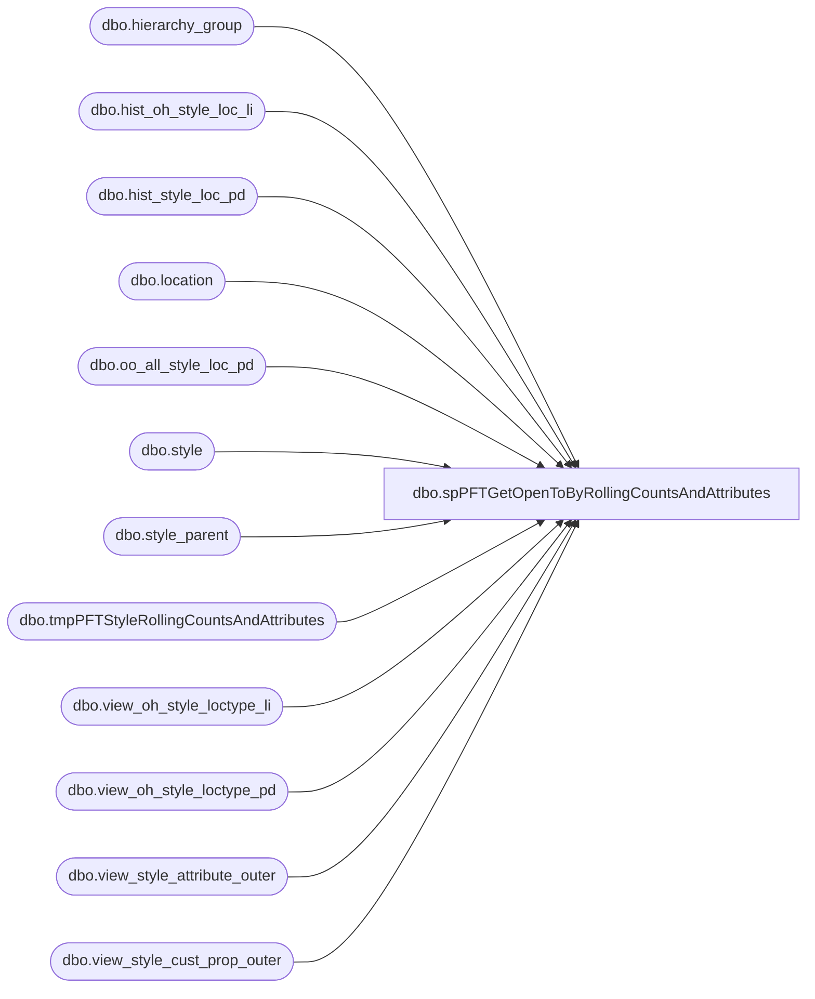

# dbo.spPFTGetOpenToByRollingCountsAndAttributes

**Database:** DBAUtility  
**Server:** bedrockdb02  

## Architecture Diagram



## Table Dependencies

| Referenced Table |
|---|
| dbo.hierarchy_group |
| dbo.hist_oh_style_loc_li |
| dbo.hist_style_loc_pd |
| dbo.location |
| dbo.oo_all_style_loc_pd |
| dbo.style |
| dbo.style_parent |
| dbo.tmpPFTStyleRollingCountsAndAttributes |
| dbo.view_oh_style_loctype_li |
| dbo.view_oh_style_loctype_pd |
| dbo.view_style_attribute_outer |
| dbo.view_style_cust_prop_outer |

## Stored Procedure Code

```sql
CREATE PROCEDURE [dbo].[spPFTGetOpenToByRollingCountsAndAttributes]
	@inputDate AS DATE
AS
BEGIN

	SET NOCOUNT ON;

	-- =============================================================================================================
-- Name: spPFTGetOpenToByRollingCountsAndAttributes
--
-- Description:	Gets Open To Buy Rolling counts and attributes for Purchasing Forecasting Tool from Merchandising
--
-- Output: 
-- 
-- Available actions: 
--
-- Revision History
--		Name:			Date:			Comments:
--		Ben Barud		09/26/2016		Creation
--		Ben Barud		10/17/2016		Added Jurisdiction Code Logic
-- =============================================================================================================

IF OBJECT_ID('tmpPFTStyleRollingCountsAndAttributes') IS NULL
BEGIN
	CREATE TABLE [dbo].[tmpPFTStyleRollingCountsAndAttributes](
		[StyleCode] [nvarchar](20) NULL,
		[StyleLongDesc] [nvarchar](120) NULL,
		[SubClassCode] [nvarchar](20) NULL,
		[SubClassLabel] [nvarchar](40) NULL,
		[NumberOfUnitsPerPack] [nvarchar](30) NULL,
		[StyleLastPOCost] [numeric](14, 2) NULL,
		[AvailableUnits1PeriodsAgo] [int] NULL,
		[AvailableUnits2PeriodsAgo] [int] NULL,
		[AvailableUnits3PeriodsAgo] [int] NULL,
		[AvailableUnits4PeriodsAgo] [int] NULL,
		[AvailableUnits5PeriodsAgo] [int] NULL,
		[AvailableUnits6PeriodsAgo] [int] NULL,
		[AvailableUnits7PeriodsAgo] [int] NULL,
		[AvailableUnits8PeriodsAgo] [int] NULL,
		[AvailableUnits9PeriodsAgo] [int] NULL,
		[AvailableUnits10PeriodsAgo] [int] NULL,
		[AvailableUnits11PeriodsAgo] [int] NULL,
		[AvailableUnits12PeriodsAgo] [int] NULL,
		[AvailableUnitsCurrentPeriod] [int] NULL,
		[NetReceiptsUnits1PeriodsAgo] [int] NULL,
		[NetReceiptsUnits2PeriodsAgo] [int] NULL,
		[NetReceiptsUnits3PeriodsAgo] [int] NULL,
		[NetReceiptsUnits4PeriodsAgo] [int] NULL,
		[NetReceiptsUnits5PeriodsAgo] [int] NULL,
		[NetReceiptsUnits6PeriodsAgo] [int] NULL,
		[NetReceiptsUnits7PeriodsAgo] [int] NULL,
		[NetReceiptsUnits8PeriodsAgo] [int] NULL,
		[NetReceiptsUnits9PeriodsAgo] [int] NULL,
		[NetReceiptsUnits10PeriodsAgo] [int] NULL,
		[NetReceiptsUnits11PeriodsAgo] [int] NULL,
		[NetReceiptsUnits12PeriodsAgo] [int] NULL,
		[NetReceiptsUnitsCurrentPeriod] [int] NULL,
		[OnOrderUnitsLast3Periods] [int] NULL,
		[OnOrderUnitsCurrentPeriod] [int] NULL,
		[OnOrderUnitsNext1Periods] [int] NULL,
		[OnOrderUnitsNext2Periods] [int] NULL,
		[OnOrderUnitsNext3Periods] [int] NULL,
		[OnOrderUnitsNext4Periods] [int] NULL,
		[OnOrderUnitsNext5Periods] [int] NULL,
		[OnOrderUnitsNext6Periods] [int] NULL,
		[AvailableUnitsEndOfCurrentPeriod] [int] NULL,
		[StyleCategory] [nvarchar](30) NULL,
		[StyleInventoryStatus] [nvarchar](6) NULL,
		[EndOfCurrentPeriodTotalCost] [numeric](38, 2) NULL,
		[StyleCouponOutDate] [nvarchar](30) NULL,
		[StyleFactory] [nvarchar](30) NULL,
		[MerchandisingStyleID] [numeric](12, 0) NULL,
		[JurisdictionCode] [nvarchar](2) NULL
	) ON [PRIMARY]
END
ELSE
BEGIN
	TRUNCATE TABLE tmpPFTStyleRollingCountsAndAttributes
END

	IF OBJECT_ID('tempdb..#SVWORK1') IS NOT NULL
	DROP TABLE #SVWORK1

	IF OBJECT_ID('tempdb..#SVWORK2') IS NOT NULL
		DROP TABLE #SVWORK2

	IF OBJECT_ID('tempdb..#SVWORK3') IS NOT NULL
		DROP TABLE #SVWORK3

	IF OBJECT_ID('tempdb..#SVWORK4') IS NOT NULL
		DROP TABLE #SVWORK4

	IF OBJECT_ID('tempdb..#SVWORK5') IS NOT NULL
		DROP TABLE #SVWORK5

	IF OBJECT_ID('tempdb..#SVWORK6') IS NOT NULL
		DROP TABLE #SVWORK6

	IF OBJECT_ID('tempdb..#SVWORKV11_1') IS NOT NULL
		DROP TABLE #SVWORKV11_1

	IF OBJECT_ID('tempdb..#SVWORKQ11') IS NOT NULL
		DROP TABLE #SVWORKQ11

	IF OBJECT_ID('tempdb..#SVWORKQ11_1') IS NOT NULL
		DROP TABLE #SVWORKQ11_1

	IF OBJECT_ID('tempdb..#SVWORKQ11_2') IS NOT NULL
		DROP TABLE #SVWORKQ11_2

	IF OBJECT_ID('tempdb..#SVWORK6_T') IS NOT NULL
		DROP TABLE #SVWORK6_T

	--DECLARE @inputDate DATE
	--SET @inputDate = '2018-10-15'

	DECLARE @currentPeriod INT, @1Period INT, @2Period INT, @3Period INT, @4Period INT, @5Period INT, @6Period INT, @7Period INT, @8Period INT, @9Period INT, @10Period INT, @11Period INT, @12Period INT, @13Period INT

	SET @currentPeriod = CAST(DATEPART(yyyy, @inputDate) AS VARCHAR(4)) + RIGHT('00' + CAST(DATEPART(mm, @inputDate) AS VARCHAR(2)), 2)
	SET @1Period = CAST(DATEPART(yyyy, DATEADD(mm, -1, @inputDate)) AS VARCHAR(4)) + RIGHT('00' + CAST(DATEPART(mm, DATEADD(mm, -1, @inputDate)) AS VARCHAR(2)), 2)
	IF @1Period >= 201807
	BEGIN
		SET @1Period = 239912
	END
	SET @2Period = CAST(DATEPART(yyyy, DATEADD(mm, -2, @inputDate)) AS VARCHAR(4)) + RIGHT('00' + CAST(DATEPART(mm, DATEADD(mm, -2, @inputDate)) AS VARCHAR(2)), 2)
	IF @2Period >= 201807
	BEGIN
		SET @2Period = 239912
	END
	SET @3Period = CAST(DATEPART(yyyy, DATEADD(mm, -3, @inputDate)) AS VARCHAR(4)) + RIGHT('00' + CAST(DATEPART(mm, DATEADD(mm, -3, @inputDate)) AS VARCHAR(2)), 2)
	IF @3Period >= 201807
	BEGIN
		SET @3Period = 239912
	END
	SET @4Period = CAST(DATEPART(yyyy, DATEADD(mm, -4, @inputDate)) AS VARCHAR(4)) + RIGHT('00' + CAST(DATEPART(mm, DATEADD(mm, -4, @inputDate)) AS VARCHAR(2)), 2)
	IF @4Period >= 201807
	BEGIN
		SET @4Period = 239912
	END
	SET @5Period = CAST(DATEPART(yyyy, DATEADD(mm, -5, @inputDate)) AS VARCHAR(4)) + RIGHT('00' + CAST(DATEPART(mm, DATEADD(mm, -5, @inputDate)) AS VARCHAR(2)), 2)
	IF @5Period >= 201807
	BEGIN
		SET @5Period = 239912
	END
	SET @6Period = CAST(DATEPART(yyyy, DATEADD(mm, -6, @inputDate)) AS VARCHAR(4)) + RIGHT('00' + CAST(DATEPART(mm, DATEADD(mm, -6, @inputDate)) AS VARCHAR(2)), 2)
	IF @6Period >= 201807
	BEGIN
		SET @6Period = 239912
	END
	SET @7Period = CAST(DATEPART(yyyy, DATEADD(mm, -7, @inputDate)) AS VARCHAR(4)) + RIGHT('00' + CAST(DATEPART(mm, DATEADD(mm, -7, @inputDate)) AS VARCHAR(2)), 2)
	IF @7Period >= 201807
	BEGIN
		SET @7Period = 239912
	END
	SET @8Period = CAST(DATEPART(yyyy, DATEADD(mm, -8, @inputDate)) AS VARCHAR(4)) + RIGHT('00' + CAST(DATEPART(mm, DATEADD(mm, -8, @inputDate)) AS VARCHAR(2)), 2)
	IF @8Period >= 201807
	BEGIN
		SET @8Period = 239912
	END
	SET @9Period = CAST(DATEPART(yyyy, DATEADD(mm, -9, @inputDate)) AS VARCHAR(4)) + RIGHT('00' + CAST(DATEPART(mm, DATEADD(mm, -9, @inputDate)) AS VARCHAR(2)), 2)
	IF @9Period >= 201807
	BEGIN
		SET @9Period = 239912
	END
	SET @10Period = CAST(DATEPART(yyyy, DATEADD(mm, -10, @inputDate)) AS VARCHAR(4)) + RIGHT('00' + CAST(DATEPART(mm, DATEADD(mm, -10, @inputDate)) AS VARCHAR(2)), 2)
	IF @10Period >= 201807
	BEGIN
		SET @10Period = 239912
	END
	SET @11Period = CAST(DATEPART(yyyy, DATEADD(mm, -11, @inputDate)) AS VARCHAR(4)) + RIGHT('00' + CAST(DATEPART(mm, DATEADD(mm, -11, @inputDate)) AS VARCHAR(2)), 2)
	IF @11Period >= 201807
	BEGIN
		SET @11Period = 239912
	END
	SET @12Period = CAST(DATEPART(yyyy, DATEADD(mm, -12, @inputDate)) AS VARCHAR(4)) + RIGHT('00' + CAST(DATEPART(mm, DATEADD(mm, -12, @inputDate)) AS VARCHAR(2)), 2)
	IF @12Period >= 201807
	BEGIN
		SET @12Period = 239912
	END

	SELECT DISTINCT a.style_id as Field_a 
	INTO #SVWORKQ11_1  
	FROM BEDROCKDB02.ma_01.dbo.style a
		,BEDROCKDB02.ma_01.dbo.hierarchy_group b
		,BEDROCKDB02.ma_01.dbo.style_parent c 
	WHERE a.style_id = c.style_id and c.hierarchy_level_id = 10000005 
	  AND c.parent_hierarchy_group_id = b.hierarchy_group_id  
	  AND (b.hierarchy_group_code IN (N'R-B-D-60', N'R-B-C-60', N'R-B-U-60', N'R-B-D-46', N'R-B-C-46', N'R-B-U-46')) 

	SELECT DISTINCT a.location_id as Field_a 
	INTO #SVWORKQ11_2  
	FROM BEDROCKDB02.ma_01.dbo.location a 
	WHERE (a.location_code IN (N'0980', N'0960', N'0975', N'2970', N'3970', N'3980')) 

	SELECT DISTINCT a.Field_a as Field_a 
				   ,b.Field_a as Field_b 
	INTO #SVWORKQ11  
	FROM #SVWORKQ11_1 a 
		,#SVWORKQ11_2 b 

	Drop Table #SVWORKQ11_1
	Drop Table #SVWORKQ11_2

	UPDATE STATISTICS #SVWORKQ11 

	SELECT SUM((a.received_units-a.return_to_vendor_units) * (1 - abs (sign (merch_year_pd -@1Period)))) as Field_t
		  ,SUM((a.received_units-a.return_to_vendor_units) * (1 - abs (sign (merch_year_pd -@2Period)))) as Field_u
		  ,SUM((a.received_units-a.return_to_vendor_units) * (1 - abs (sign (merch_year_pd -@3Period)))) as Field_v
		  ,SUM((a.received_units-a.return_to_vendor_units) * (1 - abs (sign (merch_year_pd -@4Period)))) as Field_w
		  ,SUM((a.received_units-a.return_to_vendor_units) * (1 - abs (sign (merch_year_pd -@5Period)))) as Field_x
		  ,SUM((a.received_units-a.return_to_vendor_units) * (1 - abs (sign (merch_year_pd -@6Period)))) as Field_y
		  ,SUM((a.received_units-a.return_to_vendor_units) * (1 - abs (sign (merch_year_pd -@7Period)))) as Field_z
		  ,SUM((a.received_units-a.return_to_vendor_units) * (1 - abs (sign (merch_year_pd -@8Period)))) as Field_0
		  ,SUM((a.received_units-a.return_to_vendor_units) * (1 - abs (sign (merch_year_pd -@9Period)))) as Field_1
		  ,SUM((a.received_units-a.return_to_vendor_units) * (1 - abs (sign (merch_year_pd -@10Period)))) as Field_2
		  ,SUM((a.received_units-a.return_to_vendor_units) * (1 - abs (sign (merch_year_pd -@11Period)))) as Field_3
		  ,SUM((a.received_units-a.return_to_vendor_units) * (1 - abs (sign (merch_year_pd -@12Period)))) as Field_4
		  ,SUM((a.received_units-a.return_to_vendor_units) * (1 - abs (sign (merch_year_pd -@currentPeriod)))) as Field_5
		  ,Q1.Field_a as QField_a 
	INTO #SVWORK1  
	FROM BEDROCKDB02.ma_01.dbo.hist_style_loc_pd a
		,#SVWORKQ11 Q1 
	WHERE Q1.Field_a = a.style_id 
	  AND Q1.Field_b = a.location_id 
	GROUP BY Q1.Field_a 

	SELECT SUM((a.on_hand_cost)) as Field_h1
		  ,Q1.Field_a as QField_a 
	INTO #SVWORK2  
	FROM BEDROCKDB02.ma_01.dbo.hist_oh_style_loc_li a
		,#SVWORKQ11 Q1 
	WHERE Q1.Field_a = a.style_id 
	  AND Q1.Field_b = a.location_id 
	GROUP BY Q1.Field_a 

	SET @1Period = CAST(DATEPART(yyyy, DATEADD(mm, -3, @inputDate)) AS VARCHAR(4)) + RIGHT('00' + CAST(DATEPART(mm, DATEADD(mm, -3, @inputDate)) AS VARCHAR(2)), 2)
	IF @1Period >= 201807
	BEGIN
		SET @1Period = 239912
	END
	SET @2Period = CAST(DATEPART(yyyy, DATEADD(mm, 1, @inputDate)) AS VARCHAR(4)) + RIGHT('00' + CAST(DATEPART(mm, DATEADD(mm, 1, @inputDate)) AS VARCHAR(2)), 2)
	SET @3Period = CAST(DATEPART(yyyy, DATEADD(mm, 2, @inputDate)) AS VARCHAR(4)) + RIGHT('00' + CAST(DATEPART(mm, DATEADD(mm, 2, @inputDate)) AS VARCHAR(2)), 2)
	SET @4Period = CAST(DATEPART(yyyy, DATEADD(mm, 3, @inputDate)) AS VARCHAR(4)) + RIGHT('00' + CAST(DATEPART(mm, DATEADD(mm, 3, @inputDate)) AS VARCHAR(2)), 2)
	SET @5Period = CAST(DATEPART(yyyy, DATEADD(mm, 4, @inputDate)) AS VARCHAR(4)) + RIGHT('00' + CAST(DATEPART(mm, DATEADD(mm, 4, @inputDate)) AS VARCHAR(2)), 2)
	SET @6Period = CAST(DATEPART(yyyy, DATEADD(mm, 5, @inputDate)) AS VARCHAR(4)) + RIGHT('00' + CAST(DATEPART(mm, DATEADD(mm, 5, @inputDate)) AS VARCHAR(2)), 2)
	SET @7Period = CAST(DATEPART(yyyy, DATEADD(mm, 6, @inputDate)) AS VARCHAR(4)) + RIGHT('00' + CAST(DATEPART(mm, DATEADD(mm, 6, @inputDate)) AS VARCHAR(2)), 2)


	SELECT SUM(a.on_order_units * (sign (1 + sign (merch_year_pd -@1Period))) *  (1 - sign (1 + sign (merch_year_pd -@currentPeriod)))) as Field_6
	--SELECT 0 as Field_6
		  ,SUM(a.on_order_units * (1 - abs (sign (merch_year_pd -@currentPeriod)))) as Field_7
		  ,SUM(a.on_order_units * (1 - abs (sign (merch_year_pd -@2Period)))) as Field_8
		  ,SUM(a.on_order_units * (1 - abs (sign (merch_year_pd -@3Period)))) as Field_9
		  ,SUM(a.on_order_units * (1 - abs (sign (merch_year_pd -@4Period)))) as Field_a1
		  ,SUM(a.on_order_units * (1 - abs (sign (merch_year_pd -@5Period)))) as Field_b1
		  ,SUM(a.on_order_units * (1 - abs (sign (merch_year_pd -@6Period)))) as Field_c1
		  ,SUM(a.on_order_units * (1 - abs (sign (merch_year_pd -@7Period)))) as Field_d1, Q1.Field_a as QField_a 
	INTO #SVWORK3  
	FROM BEDROCKDB02.ma_01.dbo.oo_all_style_loc_pd a
		,#SVWORKQ11 Q1 
	WHERE Q1.Field_a = a.style_id AND Q1.Field_b = a.location_id 
	GROUP BY Q1.Field_a 

	SET @1Period = CAST(DATEPART(yyyy, DATEADD(mm, -1, @inputDate)) AS VARCHAR(4)) + RIGHT('00' + CAST(DATEPART(mm, DATEADD(mm, -1, @inputDate)) AS VARCHAR(2)), 2)
	--SELECT @1Period
	IF @1Period >= 201807
	BEGIN
		SET @1Period = 239912
	END
	SET @2Period = CAST(DATEPART(yyyy, DATEADD(mm, -2, @inputDate)) AS VARCHAR(4)) + RIGHT('00' + CAST(DATEPART(mm, DATEADD(mm, -2, @inputDate)) AS VARCHAR(2)), 2)
	--SELECT @2Period
	IF @2Period >= 201807
	BEGIN
		SET @2Period = 239912
	END
	SET @3Period = CAST(DATEPART(yyyy, DATEADD(mm, -3, @inputDate)) AS VARCHAR(4)) + RIGHT('00' + CAST(DATEPART(mm, DATEADD(mm, -3, @inputDate)) AS VARCHAR(2)), 2)
	IF @3Period >= 201807
	BEGIN
		SET @3Period = 239912
	END
	SET @4Period = CAST(DATEPART(yyyy, DATEADD(mm, -4, @inputDate)) AS VARCHAR(4)) + RIGHT('00' + CAST(DATEPART(mm, DATEADD(mm, -4, @inputDate)) AS VARCHAR(2)), 2)
	IF @4Period >= 201807
	BEGIN
		SET @4Period = 239912
	END
	SET @5Period = CAST(DATEPART(yyyy, DATEADD(mm, -5, @inputDate)) AS VARCHAR(4)) + RIGHT('00' + CAST(DATEPART(mm, DATEADD(mm, -5, @inputDate)) AS VARCHAR(2)), 2)
	IF @5Period >= 201807
	BEGIN
		SET @5Period = 239912
	END
	SET @6Period = CAST(DATEPART(yyyy, DATEADD(mm, -6, @inputDate)) AS VARCHAR(4)) + RIGHT('00' + CAST(DATEPART(mm, DATEADD(mm, -6, @inputDate)) AS VARCHAR(2)), 2)
	IF @6Period >= 201807
	BEGIN
		SET @6Period = 239912
	END
	SET @7Period = CAST(DATEPART(yyyy, DATEADD(mm, -7, @inputDate)) AS VARCHAR(4)) + RIGHT('00' + CAST(DATEPART(mm, DATEADD(mm, -7, @inputDate)) AS VARCHAR(2)), 2)
	IF @7Period >= 201807
	BEGIN
		SET @7Period = 239912
	END
	SET @8Period = CAST(DATEPART(yyyy, DATEADD(mm, -8, @inputDate)) AS VARCHAR(4)) + RIGHT('00' + CAST(DATEPART(mm, DATEADD(mm, -8, @inputDate)) AS VARCHAR(2)), 2)
	IF @8Period >= 201807
	BEGIN
		SET @8Period = 239912
	END
	SET @9Period = CAST(DATEPART(yyyy, DATEADD(mm, -9, @inputDate)) AS VARCHAR(4)) + RIGHT('00' + CAST(DATEPART(mm, DATEADD(mm, -9, @inputDate)) AS VARCHAR(2)), 2)
	IF @9Period >= 201807
	BEGIN
		SET @9Period = 239912
	END
	SET @10Period = CAST(DATEPART(yyyy, DATEADD(mm, -10, @inputDate)) AS VARCHAR(4)) + RIGHT('00' + CAST(DATEPART(mm, DATEADD(mm, -10, @inputDate)) AS VARCHAR(2)), 2)
	IF @10Period >= 201807
	BEGIN
		SET @10Period = 239912
	END
	SET @11Period = CAST(DATEPART(yyyy, DATEADD(mm, -11, @inputDate)) AS VARCHAR(4)) + RIGHT('00' + CAST(DATEPART(mm, DATEADD(mm, -11, @inputDate)) AS VARCHAR(2)), 2)
	IF @11Period >= 201807
	BEGIN
		SET @11Period = 239912
	END
	SET @12Period = CAST(DATEPART(yyyy, DATEADD(mm, -12, @inputDate)) AS VARCHAR(4)) + RIGHT('00' + CAST(DATEPART(mm, DATEADD(mm, -12, @inputDate)) AS VARCHAR(2)), 2)
	IF @12Period >= 201807
	BEGIN
		SET @12Period = 239912
	END
	SET @13Period = CAST(DATEPART(yyyy, DATEADD(mm, -13, @inputDate)) AS VARCHAR(4)) + RIGHT('00' + CAST(DATEPART(mm, DATEADD(mm, -13, @inputDate)) AS VARCHAR(2)), 2)
	IF @13Period >= 201807
	BEGIN
		SET @13Period = 239912
	END

	SELECT SUM((a.on_hand_units) * (1 - abs (sign (a.location_type -4))) * (1 - abs (sign (a.inventory_status_id -1 ))) * (1 - abs (sign (merch_year_pd - @2Period)))) as Field_g
		  ,SUM((a.on_hand_units) * (1 - abs (sign (a.location_type -4))) * (1 - abs (sign (a.inventory_status_id -1 ))) * (1 - abs (sign (merch_year_pd - @3Period)))) as Field_h
		  ,SUM((a.on_hand_units) * (1 - abs (sign (a.location_type -4))) * (1 - abs (sign (a.inventory_status_id -1 ))) * (1 - abs (sign (merch_year_pd - @4Period)))) as Field_i
		  ,SUM((a.on_hand_units) * (1 - abs (sign (a.location_type -4))) * (1 - abs (sign (a.inventory_status_id -1 ))) * (1 - abs (sign (merch_year_pd - @5Period)))) as Field_j
		  ,SUM((a.on_hand_units) * (1 - abs (sign (a.location_type -4))) * (1 - abs (sign (a.inventory_status_id -1 ))) * (1 - abs (sign (merch_year_pd - @6Period)))) as Field_k
		  ,SUM((a.on_hand_units) * (1 - abs (sign (a.location_type -4))) * (1 - abs (sign (a.inventory_status_id -1 ))) * (1 - abs (sign (merch_year_pd - @7Period)))) as Field_l
		  ,SUM((a.on_hand_units) * (1 - abs (sign (a.location_type -4))) * (1 - abs (sign (a.inventory_status_id -1 ))) * (1 - abs (sign (merch_year_pd - @8Period)))) as Field_m
		  ,SUM((a.on_hand_units) * (1 - abs (sign (a.location_type -4))) * (1 - abs (sign (a.inventory_status_id -1 ))) * (1 - abs (sign (merch_year_pd - @9Period)))) as Field_n
		  ,SUM((a.on_hand_units) * (1 - abs (sign (a.location_type -4))) * (1 - abs (sign (a.inventory_status_id -1 ))) * (1 - abs (sign (merch_year_pd - @10Period)))) as Field_o
		  ,SUM((a.on_hand_units) * (1 - abs (sign (a.location_type -4))) * (1 - abs (sign (a.inventory_status_id -1 ))) * (1 - abs (sign (merch_year_pd - @11Period)))) as Field_p
		  ,SUM((a.on_hand_units) * (1 - abs (sign (a.location_type -4))) * (1 - abs (sign (a.inventory_status_id -1 ))) * (1 - abs (sign (merch_year_pd - @12Period)))) as Field_q
		  ,SUM((a.on_hand_units) * (1 - abs (sign (a.location_type -4))) * (1 - abs (sign (a.inventory_status_id -1 ))) * (1 - abs (sign (merch_year_pd - @13Period)))) as Field_r
		  ,SUM((a.on_hand_units) * (1 - abs (sign (a.location_type -4))) * (1 - abs (sign (a.inventory_status_id -1 ))) * (1 - abs (sign (merch_year_pd - @1Period)))) as Field_s
		  ,Q1.Field_a as QField_a 
	INTO #SVWORK4  
	FROM BEDROCKDB02.ma_01.dbo.view_oh_style_loctype_pd a
		,#SVWORKQ11 Q1 
	WHERE Q1.Field_a = a.style_id AND Q1.Field_b = a.location_id 
	GROUP BY Q1.Field_a 

	SELECT SUM((a.on_hand_units) * (1 - abs (sign (a.location_type -4))) * (1 - abs (sign (a.inventory_status_id -1 )))) as Field_e1
		  ,Q1.Field_a as QField_a 
	INTO #SVWORK5  
	FROM BEDROCKDB02.ma_01.dbo.view_oh_style_loctype_li a
		,#SVWORKQ11 Q1 
	WHERE Q1.Field_a = a.style_id AND Q1.Field_b = a.location_id 
	GROUP BY Q1.Field_a 

	SELECT QField_a 
	INTO #SVWORK6  
	FROM #SVWORK1 
	UNION 
	SELECT QField_a 
	FROM #SVWORK2 
	UNION 
	SELECT QField_a 
	FROM #SVWORK3 
	UNION 
	SELECT QField_a 
	FROM #SVWORK4 
	UNION 
	SELECT QField_a 
	FROM #SVWORK5  

	SELECT DISTINCT QField_a as QField_a 
	INTO #SVWORK6_T  
	FROM #SVWORK6 

	UPDATE STATISTICS #SVWORK6_T 

	SELECT DISTINCT a.style_code as Field_a
				   ,a.long_desc as Field_b
				   ,d.hierarchy_group_code as Field_c
				   ,d.hierarchy_group_label as Field_d
				   ,c01.custom_property_value as Field_e
				   ,a.last_po_cost as Field_f
				   ,c02.custom_property_value as Field_g
				   ,b03.attribute_set_code as Field_h
				   ,c04.custom_property_value as Field_i
				   ,b05.attribute_set_label as Field_j
				   ,a.style_id as Field_k 
	INTO #SVWORKV11_1  
	FROM BEDROCKDB02.ma_01.dbo.style a
		,BEDROCKDB02.ma_01.dbo.view_style_attribute_outer b03
		,BEDROCKDB02.ma_01.dbo.view_style_attribute_outer b05
		,BEDROCKDB02.ma_01.dbo.view_style_cust_prop_outer c01
		,BEDROCKDB02.ma_01.dbo.view_style_cust_prop_outer c02
		,BEDROCKDB02.ma_01.dbo.view_style_cust_prop_outer c04
		,BEDROCKDB02.ma_01.dbo.hierarchy_group d
		,BEDROCKDB02.ma_01.dbo.style_parent e
		,#SVWORK6_T U1 
	WHERE a.style_id =b03.style_id and  b03.attribute_id = 72 
	  AND a.style_id =b05.style_id and  b05.attribute_id = 122  
	  AND a.style_id =c01.style_id and c01.custom_property_id = 2 
	  AND a.style_id =c02.style_id and c02.custom_property_id = 51 
	  AND a.style_id =c04.style_id and c04.custom_property_id = 6  
	  AND a.style_id = e.style_id and e.hierarchy_level_id = 10000007 
	  AND e.parent_hierarchy_group_id = d.hierarchy_group_id  
	  AND (a.style_id = U1.QField_a) AND d.hierarchy_level_id = 10000007 

	Drop Table #SVWORK6_T

	INSERT INTO tmpPFTStyleRollingCountsAndAttributes ([Style Code]
      ,[Style Long Desc]
      ,[Sub-Class Code]
      ,[Sub-Class Label]
      ,[NUMBER OF UNITS PER PACK]
      ,[Style Last PO Cost]
      ,[BOP OH WH Units:InvStatus[Available]] ( 1 Periods(s) Ago )]
      ,[BOP OH WH Units:InvStatus  ( 2 Periods(s) Ago )]
      ,[BOP OH WH Units:InvStatus  ( 3 Periods(s) Ago )]
      ,[BOP OH WH Units:InvStatus  ( 4 Periods(s) Ago )]
      ,[BOP OH WH Units:InvStatus  ( 5 Periods(s) Ago )]
      ,[BOP OH WH Units:InvStatus  ( 6 Periods(s) Ago )]
      ,[BOP OH WH Units:InvStatus  ( 7 Periods(s) Ago )]
      ,[BOP OH WH Units:InvStatus  ( 8 Periods(s) Ago )]
      ,[BOP OH WH Units:InvStatus  ( 9 Periods(s) Ago )]
      ,[BOP OH WH Units:InvStatus  ( 10 Periods(s) Ago )]
      ,[BOP OH WH Units:InvStatus  ( 11 Periods(s) Ago )]
      ,[BOP OH WH Units:InvStatus  ( 12 Periods(s) Ago )]
      ,[BOP OH WH Units:InvStatus[Available]] ( This Period )]
      ,[Net Receipts Units ( 1 Period(s) Ago )]
      ,[Net Receipts Units ( 2 Period(s) Ago )]
      ,[Net Receipts Units ( 3 Period(s) Ago )]
      ,[Net Receipts Units ( 4 Period(s) Ago )]
      ,[Net Receipts Units ( 5 Period(s) Ago )]
      ,[Net Receipts Units ( 6 Period(s) Ago )]
      ,[Net Receipts Units ( 7 Period(s) Ago )]
      ,[Net Receipts Units ( 8 Period(s) Ago )]
      ,[Net Receipts Units ( 9 Period(s) Ago )]
      ,[Net Receipts Units ( 10 Period(s) Ago )]
      ,[Net Receipts Units ( 11 Period(s) Ago )]
      ,[Net Receipts Units ( 12 Period(s) Ago )]
      ,[Net Receipts Units ( This Period )]
      ,[On Order Units ( Last 3 Period(s) )]
      ,[On Order Units ( This Period )]
      ,[On Order Units ( Next 1 Periods )]
      ,[On Order Units ( Next 2 Periods )]
      ,[On Order Units ( Next 3 Periods )]
      ,[On Order Units ( Next 4 Periods )]
      ,[On Order Units ( Next 5 Periods )]
      ,[On Order Units ( Next 6 Periods )]
      ,[EOP OH WH Units:InvStatus[Available]] ( Current )]
      ,[Style Custom Property Value O[SUPPLY STYLE CATEGORY]]]
      ,[Style Attribute Set Code O[MEG'S INVENTOR STATUS BY STYLE]]]
      ,[EOP OH Cost:Total ( Current )]
      ,[Style Custom Property Value O[OUT DATE]]]
      ,[Style Attribute Set Label O[FACTORY]]]
      ,[Merchandising Style_ID]
      ,[JurisdictionCode]
	)
	SELECT V1_1.Field_a 'Style Code'
		  ,V1_1.Field_b 'Style Long Desc'
		  ,V1_1.Field_c 'Sub-Class Code'
		  ,V1_1.Field_d 'Sub-Class Label'
		  ,V1_1.Field_e 'NUMBER OF UNITS PER PACK'
		  ,V1_1.Field_f 'Style Last PO Cost'
		  ,ISNULL(d.Field_g, 0) 'BOP OH WH Units:InvStatus[Available] ( 1 Periods(s) Ago )'
		  ,ISNULL(d.Field_h, 0) 'BOP OH WH Units:InvStatus  ( 2 Periods(s) Ago )'
		  ,ISNULL(d.Field_i, 0) 'BOP OH WH Units:InvStatus  ( 3 Periods(s) Ago )'
		  ,ISNULL(d.Field_j, 0) 'BOP OH WH Units:InvStatus  ( 4 Periods(s) Ago )'
		  ,ISNULL(d.Field_k, 0) 'BOP OH WH Units:InvStatus  ( 5 Periods(s) Ago )'
		  ,ISNULL(d.Field_l, 0) 'BOP OH WH Units:InvStatus  ( 6 Periods(s) Ago )'
		  ,ISNULL(d.Field_m, 0) 'BOP OH WH Units:InvStatus  ( 7 Periods(s) Ago )'
		  ,ISNULL(d.Field_n, 0) 'BOP OH WH Units:InvStatus  ( 8 Periods(s) Ago )'
		  ,ISNULL(d.Field_o, 0) 'BOP OH WH Units:InvStatus  ( 9 Periods(s) Ago )'
		  ,ISNULL(d.Field_p, 0) 'BOP OH WH Units:InvStatus  ( 10 Periods(s) Ago )'
		  ,ISNULL(d.Field_q, 0) 'BOP OH WH Units:InvStatus  ( 11 Periods(s) Ago )'
		  ,ISNULL(d.Field_r, 0) 'BOP OH WH Units:InvStatus  ( 12 Periods(s) Ago )'
		  ,ISNULL(d.Field_s, 0) 'BOP OH WH Units:InvStatus[Available] ( This Period )'
		  ,ISNULL(a.Field_t, 0) 'Net Receipts Units ( 1 Period(s) Ago )'
		  ,ISNULL(a.Field_u, 0) 'Net Receipts Units ( 2 Period(s) Ago )'
		  ,ISNULL(a.Field_v, 0) 'Net Receipts Units ( 3 Period(s) Ago )'
		  ,ISNULL(a.Field_w, 0) 'Net Receipts Units ( 4 Period(s) Ago )'
		  ,ISNULL(a.Field_x, 0) 'Net Receipts Units ( 5 Period(s) Ago )'
		  ,ISNULL(a.Field_y, 0) 'Net Receipts Units ( 6 Period(s) Ago )'
		  ,ISNULL(a.Field_z, 0) 'Net Receipts Units ( 7 Period(s) Ago )'
		  ,ISNULL(a.Field_0, 0) 'Net Receipts Units ( 8 Period(s) Ago )'
		  ,ISNULL(a.Field_1, 0) 'Net Receipts Units ( 9 Period(s) Ago )'
		  ,ISNULL(a.Field_2, 0) 'Net Receipts Units ( 10 Period(s) Ago )'
		  ,ISNULL(a.Field_3, 0) 'Net Receipts Units ( 11 Period(s) Ago )'
		  ,ISNULL(a.Field_4, 0) 'Net Receipts Units ( 12 Period(s) Ago )'
		  ,ISNULL(a.Field_5, 0) 'Net Receipts Units ( This Period )'
		  ,ISNULL(c.Field_6, 0) 'On Order Units ( Last 3 Period(s) )'
		  ,ISNULL(c.Field_7, 0) 'On Order Units ( This Period )'
		  ,ISNULL(c.Field_8, 0) 'On Order Units ( Next 1 Periods )'
		  ,ISNULL(c.Field_9, 0) 'On Order Units ( Next 2 Periods )'
		  ,ISNULL(c.Field_a1, 0) 'On Order Units ( Next 3 Periods )'
		  ,ISNULL(c.Field_b1, 0) 'On Order Units ( Next 4 Periods )'
		  ,ISNULL(c.Field_c1, 0) 'On Order Units ( Next 5 Periods )'
		  ,ISNULL(c.Field_d1, 0) 'On Order Units ( Next 6 Periods )'
		  ,ISNULL(e.Field_e1, 0) 'EOP OH WH Units:InvStatus[Available] ( Current )'
		  ,V1_1.Field_g 'Style Custom Property Value O[SUPPLY STYLE CATEGORY]'
		  ,V1_1.Field_h 'Style Attribute Set Code O[MEG''S INVENTOR STATUS BY STYLE]'
		  ,b.Field_h1 'EOP OH Cost:Total ( Current )'
		  ,V1_1.Field_i 'Style Custom Property Value O[OUT DATE]'
		  ,V1_1.Field_j 'Style Attribute Set Label O[FACTORY]'
		  ,V1_1.Field_k 'Merchandising Style_ID'
		  ,CASE 
			WHEN V1_1.Field_a < 100000 THEN 'US'
			WHEN V1_1.Field_a < 200000 THEN 'CA'
			WHEN V1_1.Field_a < 500000 THEN 'UK'
			WHEN V1_1.Field_a < 900000 THEN 'CN'
		  END AS 'JurisdictionCode'
	FROM #SVWORK6 U1 
	LEFT JOIN #SVWORKV11_1 V1_1 ON  U1.QField_a = V1_1.Field_k 
	LEFT JOIN #SVWORK1 a ON  U1.QField_a = a.QField_a 
	LEFT JOIN #SVWORK2 b ON  U1.QField_a = b.QField_a 
	LEFT JOIN #SVWORK3 c ON  U1.QField_a = c.QField_a 
	LEFT JOIN #SVWORK4 d ON  U1.QField_a = d.QField_a 
	LEFT JOIN #SVWORK5 e ON  U1.QField_a = e.QField_a
	ORDER BY 1
 
END
```

