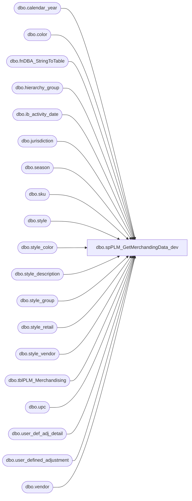

# dbo.spPLM_GetMerchandingData_dev

**Database:** DBAUtility  
**Server:** bedrockdb02  

## Architecture Diagram



## Table Dependencies

| Referenced Table |
|---|
| dbo.calendar_year |
| dbo.color |
| dbo.fnDBA_StringToTable |
| dbo.hierarchy_group |
| dbo.ib_activity_date |
| dbo.jurisdiction |
| dbo.season |
| dbo.sku |
| dbo.style |
| dbo.style_color |
| dbo.style_description |
| dbo.style_group |
| dbo.style_retail |
| dbo.style_vendor |
| dbo.tblPLM_Merchandising |
| dbo.upc |
| dbo.user_def_adj_detail |
| dbo.user_defined_adjustment |
| dbo.vendor |

## Stored Procedure Code

```sql
CREATE PROC [dbo].[spPLM_GetMerchandingData_dev]
@Action VARCHAR(20) = 'CREATE', @StyleCodes VARCHAR(2000) =''
--WITH EXECUTE AS ''
AS
-- =============================================================================================================
-- Name: spPLM_GetMerchandingData
--
-- Description:	Populates table used by PLMDB01.ProductLifecycleManagement.dbo.usp_InsertExportStyle
--
-- Output: Error logging.
-- 
-- Available actions: 
--
-- @Action:
--	'ReturnVersion' = Do not do anything but return the version of the objects
--	'CREATE' = TRUNCATE then populate tblPLM_Merchandising
--	'DROP' = just TRUNCATE tblPLM_Merchandising
--
-- Dependency: 
--	OURSMERCHDB01.me_01 tables
--
-- Revision History
--		Name:			Date:			Comments:
--		Mike Pelikan	10/28/2013		Creation
--
-- =============================================================================================================
DECLARE @Revision DATETIME
SET @Revision = '10/28/2013'
/*
DECLARE @Action VARCHAR(15)
SET @Action = 'Process'

exec spMaintainProducts

*/
-- =============================================================================================================

----------------------------------------------------------------------------------------------------
--// Set options                                                                                //--
----------------------------------------------------------------------------------------------------
SET NOCOUNT ON

----------------------------------------------------------------------------------------------------
--// Revision                                                                                  //--
----------------------------------------------------------------------------------------------------
IF @Action = 'ReturnVersion'
BEGIN
	GOTO EndHere
END

SET NOCOUNT ON 
TRUNCATE TABLE DBAUtility.dbo.tblPLM_Merchandising

IF @Action = 'CREATE'
BEGIN
	IF OBJECT_ID('tempdb..#mjp') IS NOT NULL DROP TABLE #mjp

	SELECT Val StyleCode INTO #mjp FROM dbo.fnDBA_StringToTable(@StyleCodes, ',',1)

	INSERT INTO DBAUtility.dbo.tblPLM_Merchandising (StyleCode, MerchandiseGroupCode, LongDescription, ShortDescription, SeasonCode, Year, PLUDescription, OrderMultiple, DistributionMultiple, OriginalSellingRetail, PrimaryVendorCode, PrimaryVendorStyleCode, PrimaryVendorCurrentCost, CurrentSellingRetail, StyleStatus, LastReceiptDate)
	SELECT DISTINCT RTRIM(S.[style_code]) AS StyleCode, hg.hierarchy_group_code MerchandiseGroupCode, 
	s.long_desc LongDescription, s.short_desc ShortDescription, season.season_code SeasonCode, 
	cy.calendar_year_code Year, s.plu_desc PLUDescription, s.order_multiple OrderMultiple, 
	s.distribution_multiple DistributionMultiple, sr.OriginalSellingRetail, RTRIM(ven.[vendor_code]) PrimaryVendorCode, 
	RTRIM(SV.[vendor_style]) PrimaryVendorStyleCode, sv.current_cost PrimaryVendorCurrentCost, 
	CurrentSellingRetail, style_status StyleStatus, last_receipt_date LastReceiptDate
	FROM me_01.dbo.style s 
	INNER JOIN me_01.dbo.season season ON s.season_id = season.season_id
	INNER JOIN me_01.dbo.calendar_year cy ON s.calendar_year_id = cy.calendar_year_id
	INNER JOIN me_01.dbo.style_vendor sv ON s.style_id = sv.style_id AND 1 = sv.primary_vendor_flag
	INNER JOIN me_01.dbo.vendor ven ON sv.vendor_id = ven.vendor_id
	INNER JOIN me_01.dbo.style_group AS sg ON s.style_id = sg.style_id 
	INNER JOIN me_01.dbo.hierarchy_group AS hg ON sg.hierarchy_group_id = hg.hierarchy_group_id 
	LEFT  JOIN me_01.dbo.style_description sd ON s.style_id = sd.style_id and '100002' = sd.language_id  --canada                      
	INNER JOIN me_01.dbo.sku sku ON s.style_id = sku.style_id
	INNER JOIN me_01.dbo.upc u ON sku.sku_id = u.sku_id
	INNER JOIN me_01.dbo.style_color sc ON s.style_id = sc.style_id
	INNER JOIN me_01.dbo.color c ON sc.color_id = c.color_id 
	INNER JOIN 
	(
	 SELECT a.style_id, a.OriginalSellingRetail, b.CurrentSellingRetail
	 FROM 
	 (
	  SELECT style_id, Home OriginalSellingRetail
	  FROM (
	   select s_sub.style_id, j_sub.jurisdiction_code, sr_sub.original_selling_retail
	   from me_01.dbo.style s_sub 
	   INNER JOIN me_01.dbo.style_retail sr_sub ON s_sub.style_id = sr_sub.style_id 
	   INNER JOIN me_01.dbo.jurisdiction j_sub on sr_sub.jurisdiction_id = j_sub.jurisdiction_id
		WHERE s_sub.style_code IN (select StyleCode from #mjp) AND j_sub.jurisdiction_code = 'HOME'
	  ) as s
	  PIVOT
	  (
	   SUM(original_selling_retail)
	   FOR jurisdiction_code IN (Home)
	  )AS p
	 ) a 
	 LEFT JOIN (
	  SELECT style_id, Home CurrentSellingRetail
	  FROM (
	   SELECT s_sub.style_id, j_sub.jurisdiction_code, sr_sub.current_selling_retail
	   from me_01.dbo.style s_sub 
	   INNER JOIN me_01.dbo.style_retail sr_sub ON s_sub.style_id = sr_sub.style_id 
	   INNER JOIN me_01.dbo.jurisdiction j_sub on sr_sub.jurisdiction_id = j_sub.jurisdiction_id
	   where s_sub.style_code IN (select StyleCode from #mjp) AND j_sub.jurisdiction_code = 'HOME'
	  ) as s
	  PIVOT
	  (
	   SUM(current_selling_retail)
	   FOR jurisdiction_code IN (Home)
	  )AS p
	 ) b ON a.style_id = b.style_id
	) sr ON s.style_id = sr.style_id 
	LEFT JOIN 
	(
		select s1.style_id, isnull(max(iad.last_receipt_date), convert(varchar, min(uda.create_date),101)) last_receipt_date
		from me_01.dbo.style s1 (nolock) 
		left join me_01.dbo.ib_activity_date iad (nolock) on iad.style_id = s1.style_id
		left join me_01.dbo.user_def_adj_detail udad (nolock) on s1.style_id = udad.style_id 
		left join me_01.dbo.user_defined_adjustment uda (nolock) on udad.user_defined_adjustment_id = uda.user_defined_adjustment_id and uda.grouping_label = 'NewStyle'
		WHERE s1.style_code IN (select StyleCode from #mjp)
		GROUP BY s1.style_id  
	) ld ON s.style_id = ld.style_id
	where style_code IN (select StyleCode from #mjp)
	order by LongDescription, ShortDescription

END

EndHere:
IF @Action = 'ReturnVersion'
BEGIN
	SELECT @Revision 
END
```

