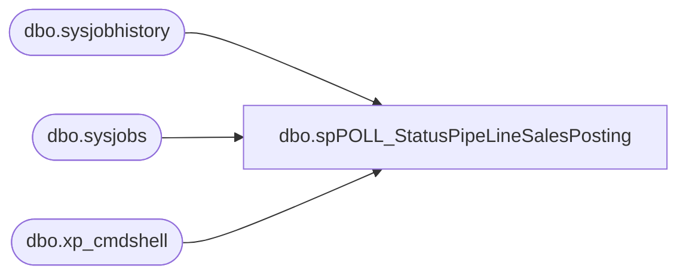

# dbo.spPOLL_StatusPipeLineSalesPosting

**Database:** DBAUtility  
**Server:** bedrockdb02  

## Architecture Diagram



## Table Dependencies

| Referenced Table |
|---|
| dbo.sysjobhistory |
| dbo.sysjobs |
| dbo.xp_cmdshell |

## Stored Procedure Code

```sql
CREATE PROCEDURE [dbo].[spPOLL_StatusPipeLineSalesPosting]
AS
SET NOCOUNT ON

DECLARE @JOBNAME VARCHAR(50), @SQL VARCHAR(2000)
SET @JOBNAME = 'MERCHANDISING - Process - Pipeline Sales Posting'
----------------------------------------------------------------------------------------
IF OBJECT_ID('tempdb..##JOBSTATUS') IS NOT NULL DROP TABLE ##JOBSTATUS
CREATE TABLE ##JOBSTATUS(JobName Varchar(100) NULL, current_execution_status Varchar(100))
SET @SQL = 'OSQL -E -Q "EXECUTE DBAUtility.dbo.spDBA_JobStatus ''MERCHANDISING - Process - Pipeline Sales Posting''"'

INSERT INTO ##JOBSTATUS (current_execution_status)
EXEC master.dbo.xp_cmdshell @SQL

UPDATE ##JOBSTATUS 
SET JobName = 'MERCHANDISING - Process - Pipeline Sales Posting', current_execution_status = LTRIM(RTRIM(current_execution_status))
DELETE FROM ##JOBSTATUS WHERE ISNULL(current_execution_status,'') NOT IN ('Executing.', 'Waiting for thread.', 'Between retries.', 'Idle.' ,'Suspended.' ,'UNKNOWN','Performing completion actions.')

---------------------------------------------------------------------------------------------

SELECT sj.name AS JobName
,CASE WHEN sj.enabled = 0
	THEN 'No'
	WHEN sj.enabled = 1
	THEN 'Yes'
END AS JobEnabled, 
current_execution_status
--, sj.originating_server AS OriginatingServer
--,description AS Description
FROM msdb..sysjobs sj
INNER JOIN ##JOBSTATUS js ON sj.name = js.JobName
WHERE sj.name = @JOBNAME
ORDER BY sj.name

SELECT
CONVERT(DATETIME, RTRIM(jh.run_date)) + (jh.run_time * 9 + jh.run_time % 10000 * 6 + jh.run_time % 100 * 10) / 216e4 AS RunDateTime
--,jh.run_date
--,jh.run_time
,j.name AS JobName
,CASE WHEN jh.run_status = 0
	THEN 'Failed'
	WHEN jh.run_status = 1
	THEN 'Succeeded'
	WHEN jh.run_status = 2
	THEN 'Retry'
	WHEN jh.run_status = 3
	THEN 'Canceled'
END AS JobOutcome
--,jh.step_id AS StepID
,SUBSTRING(RIGHT('000000' + CONVERT(varchar(6), jh.run_duration), 6), 1, 2) + ':' + SUBSTRING(RIGHT('000000' + CONVERT(varchar(6), jh.run_duration), 6), 3, 2) + ':' + SUBSTRING(RIGHT('000000' + CONVERT(varchar(6), jh.run_duration), 6), 5, 2) AS StepRunTime
--,jh.run_duration
--,jh.step_name AS StepName
,jh.message AS Message
FROM msdb..sysjobhistory jh
INNER JOIN msdb..sysjobs j ON jh.job_id = j.job_id
WHERE j.name = @JOBNAME
AND jh.run_date > convert(varchar,dateadd(day,-3,getdate()),112) -- CONVERT(VARCHAR(8), GETDATE(), 112)
AND jh.step_id = 0
AND jh.run_duration >= 0
ORDER BY jh.run_date DESC, jh.run_time DESC, j.job_id, jh.step_id


DROP  TABLE ##JOBSTATUS
```

