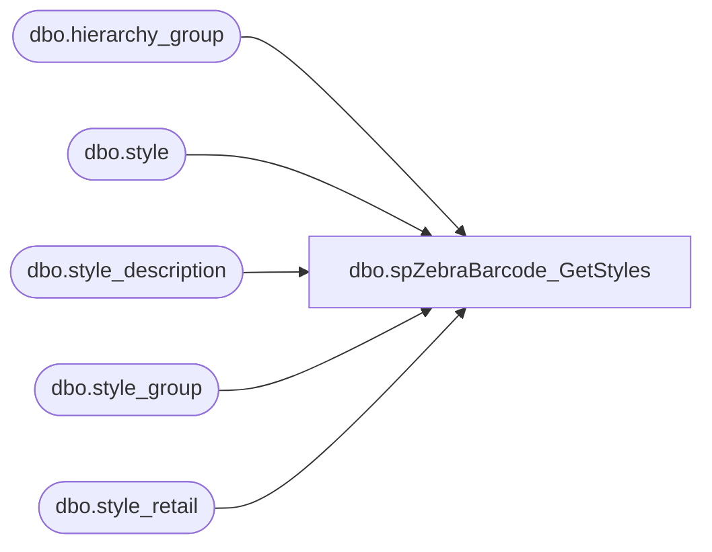

# dbo.spZebraBarcode_GetStyles

**Database:** DBAUtility  
**Server:** bedrockdb02  

## Architecture Diagram



## Table Dependencies

| Referenced Table |
|---|
| dbo.hierarchy_group |
| dbo.style |
| dbo.style_description |
| dbo.style_group |
| dbo.style_retail |

## Stored Procedure Code

```sql
-- =============================================
-- Author:		Ben Barud
-- Create date: 08/05/2013
-- Description:	Returns style information for Zebra Barcode Application
-- =============================================
CREATE PROCEDURE [dbo].[spZebraBarcode_GetStyles] 
	
	@gintJurisdictionID int
WITH EXECUTE AS 'dbo'
AS
BEGIN

	SET NOCOUNT ON;

   select distinct st.style_code, st.short_desc AS style_desc, CAST(sr.current_selling_retail AS varchar) AS cost, 
                 isnull(replace(sd.plu_desc, char(140), 'OE'),'') AS FrenchDesc 
             from me_01.dbo.style st with (nolock) 
                 join me_01.dbo.style_group sg with (nolock) 
                 on sg.style_id = st.style_id 
                 join me_01.dbo.style_retail sr with (nolock) 
                 on st.style_id = sr.style_id 
                 join me_01.dbo.hierarchy_group hg with (nolock) 
                 on hg.hierarchy_group_id = sg.hierarchy_group_id 
                 left join me_01.dbo.style_description AS sd WITH (nolock) 
                 ON sd.style_id = st.style_id 
                 AND sd.language_id = 100002
             where hierarchy_group_code not like 'R-B-D-60%' 
                 and hierarchy_group_code not like 'R-B-D-70%' 
                 and sr.current_selling_retail is not null 
                 and sr.jurisdiction_id = @gintJurisdictionID
             order by style_code

END
```

