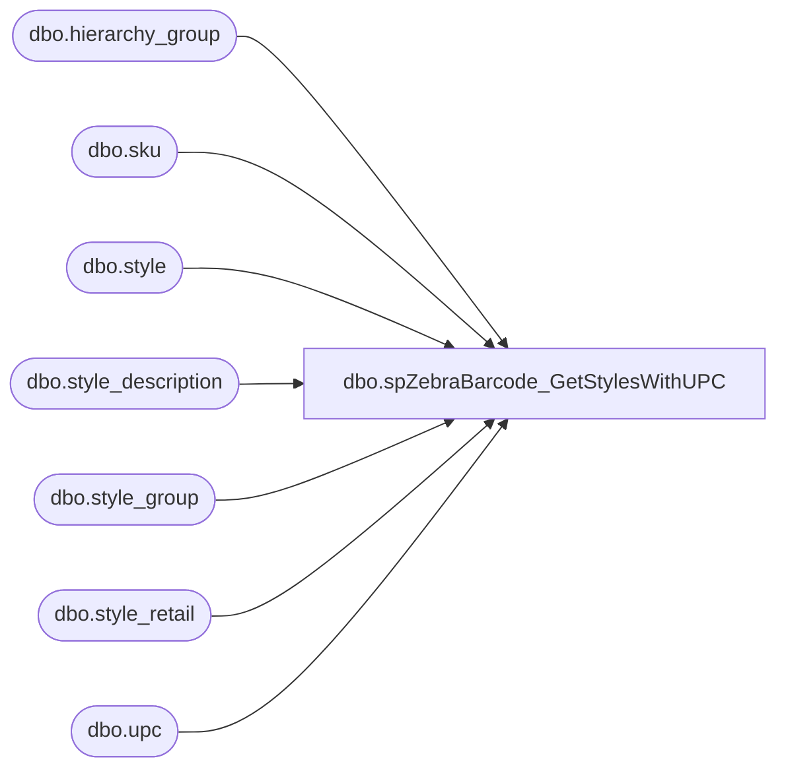

# dbo.spZebraBarcode_GetStylesWithUPC

**Database:** DBAUtility  
**Server:** bedrockdb02  

## Architecture Diagram



## Table Dependencies

| Referenced Table |
|---|
| dbo.hierarchy_group |
| dbo.sku |
| dbo.style |
| dbo.style_description |
| dbo.style_group |
| dbo.style_retail |
| dbo.upc |

## Stored Procedure Code

```sql
-- =============================================
-- Author:		Ben Barud
-- Create date: 08/05/2013
-- Description:	Returns style information for Zebra Barcode Application
-- =============================================
CREATE PROCEDURE [dbo].[spZebraBarcode_GetStylesWithUPC] 
	
	@gintJurisdictionID int
WITH EXECUTE AS 'dbo'
AS
BEGIN
	
	SET NOCOUNT ON;
	
	DECLARE @language_id AS INT
	SELECT @language_id = CASE 
							WHEN @gintJurisdictionID = 8 THEN 100006
							ELSE 100002
							END

    SELECT DISTINCT st.style_code, upc.upc_number, st.short_desc AS style_desc, CAST(sr.current_selling_retail AS VARCHAR) AS cost, 
                 isnull(replace(sd.plu_desc, CHAR(140), 'OE'),'') AS LocalDesc 
             FROM me_01.dbo.style st with (nolock) 
                 JOIN me_01.dbo.style_group sg WITH (NOLOCK) ON sg.style_id = st.style_id 
                 JOIN me_01.dbo.style_retail sr WITH (NOLOCK) ON st.style_id = sr.style_id 
                 JOIN me_01.dbo.hierarchy_group hg WITH (NOLOCK) ON hg.hierarchy_group_id = sg.hierarchy_group_id 
                 LEFT JOIN me_01.dbo.style_description AS sd WITH (NOLOCK) ON sd.style_id = st.style_id AND sd.language_id = @language_id
				 LEFT JOIN me_01.dbo.sku AS sku WITH (NOLOCK) ON st.style_id = sku.style_id
				 LEFT JOIN me_01.dbo.upc AS upc	WITH (NOLOCK) ON upc.sku_id = sku.sku_id
             where hierarchy_group_code not like 'R-B-D-60%' 
                 and hierarchy_group_code not like 'R-B-D-70%' 
                 and sr.current_selling_retail is not null 
                 and sr.jurisdiction_id = @gintJurisdictionID
             order by style_code

END
```

