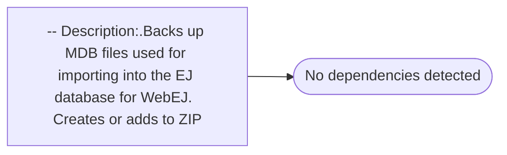

# -- Description:.Backs up MDB files used for importing into the EJ database for WebEJ.  Creates or adds to ZIP

**Database:** EJ  
**Server:** bedrockdb02  

## Architecture Diagram



## Table Dependencies

_No table references detected._

## Stored Procedure Code

```sql

```

