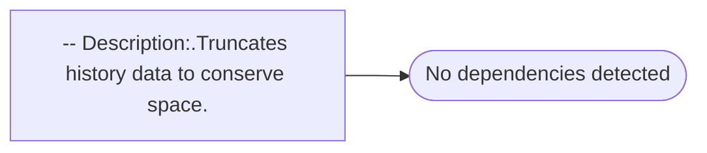

# -- Description:.Truncates history data to conserve space.

**Database:** EJ  
**Server:** bedrockdb02  

## Architecture Diagram



## Table Dependencies

_No table references detected._

## Stored Procedure Code

```sql

```

