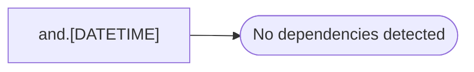

# and.[DATETIME]

**Database:** EJ  
**Server:** bedrockdb02  

## Architecture Diagram


```mermaid
flowchart LR
    SP["and.[DATETIME]"]
    SP --> NoRefs(["No dependencies detected"])
```

## Table Dependencies

_No table references detected._

## Stored Procedure Code

```sql
= @ThisDate
```

